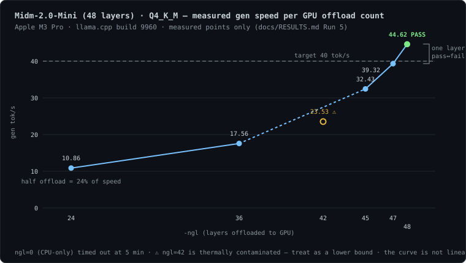
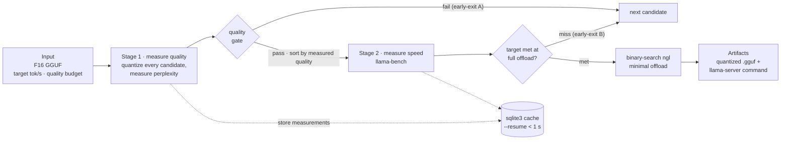

<div align="center">

[한국어](README.md) | **English**


# FiTuna

**Stop guessing your llama.cpp config. Measure it.**

Give it a model file, a target speed (tok/s) and a quality budget (%), and
it finds the lightest llama.cpp configuration — the combination of
quantization level, GPU offload and context length — that actually hits
those numbers on your machine, proven by real benchmarks.

**`pip install fituna`**

[](https://github.com/leeyunseokarchive/fituna/actions/workflows/ci.yml)
[](https://pypi.org/project/fituna/)
[](LICENSE)
[](https://www.python.org/downloads/)
[](docs/SBOM.md)
[](CONTRIBUTING.md)

**Korean reproduction guide for competition judges & verification agency → [REVIEWERS.md](REVIEWERS.md)**


</div>

## Why

Running a local LLM through llama.cpp means making three choices: how hard to
compress the model (quantization level, Q2–Q8 — lower is faster but loses
quality), how many layers to put on the GPU (`-ngl`), and how long a context
to allow. That's dozens of combinations, and today most people search them by
trial and error.

What you actually want answered are three questions. **① Will this machine
hit my target speed? ② What is the quality loss, in percent? ③ What is the
lightest config that still meets the target?** — and no tool answered them:

| | ① Target speed | ② Quality loss | ③ Minimal config |
|---|---|---|---|
| VRAM calculators | Only "does it fit" | Not addressed | Not addressed |
| Chatbot advice | Estimates — [wrong in all 3 measured trials](docs/CHATBOT_COMPARISON.md) | Generalities | "Offload everything" |
| NVIDIA AutoQuantize | No speed-target input | Addressed — but CUDA-only | CUDA-only |
| **FiTuna** | **Measured verdict** | **Measured verdict** | **Binary-searched** |

Runners like Ollama and LM Studio are absent from this table on purpose —
they execute a given config rather than answer these questions, a different
and complementary job. The config FiTuna finds can be handed straight to
Ollama via `--export-ollama`.

And once you actually measure, intuition keeps getting overturned: on an
Apple M3 Pro the "obviously best" Q8_0 failed the speed target, and the
answer wasn't a quant alone but **Q4_K_M plus the minimal offload
`-ngl 33`**. No amount of spec-sheet reading produces that answer.

## Try it in 2 minutes

The fastest way to see it work for yourself: a full pipeline run
(download → quantize → quality-gate → benchmark) on a small 258 MB model
finishes in about a minute on an M-series Mac:

```bash
brew install llama.cpp python@3.13
python3.13 -m venv .venv
source .venv/bin/activate
pip install fituna
fituna fetch-corpus --lang en --out wiki.txt
fituna run --hf bartowski/SmolLM2-135M-Instruct-GGUF \
  --target-tps 240 \
  --max-quality-loss 5 \
  --ctx 2048 \
  --quality-corpus wiki.txt \
  --out ./out --resume
```

What each `fituna run` flag means:

| Flag | Meaning | |
|---|---|---|
| `--hf bartowski/SmolLM2-…` | The model to use — a HuggingFace repo; the F16 GGUF is downloaded automatically | required¹ |
| `--target-tps 240` | Target generation speed (tok/s) | required |
| `--max-quality-loss 5` | Quality-loss budget (%) — candidates worse than this are rejected | required |
| `--ctx 2048` | Context length (how much conversation history to keep) | optional (default 4096) |
| `--quality-corpus wiki.txt` | Text for quality measurement — the file fetched just above | required |
| `--out ./out` | Output/cache directory | optional (default `./out`) |
| `--resume` | Store and reuse measurements in the cache — recommended from the first run | optional |

¹ Already have a model file on disk? Use `--model <path.gguf>` instead of `--hf`.

### Example result

When the command finishes, you get output like this (a real run on an
Apple M3 Pro):

```
FiTuna result: MEETS TARGET

  quant           : Q8_0        # <- the optimal quantization level it found
  ngl             : 26          # <- the minimum GPU offload layers meeting the target
  ctx             : 2048        # <- the verified context length

  prompt tok/s (pp): 2017.64
  gen tok/s    (tg): 261.78     # <- measured generation speed -- clears the 240 target

  perplexity      : 18.2931 (baseline 18.2407)
  quality loss    : 0.29%       # <- measured quality loss -- within the 5% budget

  artifact: out/SmolLM2-135M-Instruct-8078a5b74b5a-Q8_0.gguf  (144.8 MB -- already produced during the search)

  1) local API server (OpenAI-compatible):
       /opt/homebrew/bin/llama-server -m out/SmolLM2-135M-Instruct-8078a5b74b5a-Q8_0.gguf -ngl 26 -c 2048 --port 8080
  2) import into Ollama: re-run with --export-ollama to write a Modelfile beside the artifact
  3) terminal chat (interactive check):
       /opt/homebrew/bin/llama-cli -m out/SmolLM2-135M-Instruct-8078a5b74b5a-Q8_0.gguf -ngl 26 -c 2048
```

How to read it: the first line is the verdict — `MEETS TARGET` means a
configuration satisfying your target was found, followed by that
configuration (quant × ngl × ctx) and the measured evidence (speed and
quality loss). The quantized model on the `artifact:` line was already
produced during the search, so copying any of commands 1)–3) puts it to work
immediately. The whole run takes **about a minute** (58–83 s measured on an
M3 Pro), and running the exact same command again answers from the cache in
**under a second**. Absolute numbers and the winning quant can vary by
machine and by run —
[measured run-to-run variance](docs/RESULTS.md#run-to-run-variance-measured-not-hidden).

## Measured results

Three models of different sizes, each given a target. In all three runs the
"safe default" Q8_0 failed the speed target:

| Model | Target | What the "obvious" pick measured | What FiTuna found |
|---|---|---|---|
| Qwen3-4B-Instruct | 30 tok/s, ≤5% loss | Q8_0: 24.22 tok/s ❌ (and worse quality than Q6_K) | **Q4_K_M @ ngl=33 → 30.81 tok/s, 1.73%** ✅ |
| SmolLM2-135M | 240 tok/s, ≤5% loss | Q8_0: 205.91 tok/s ❌ | **Q6_K → 249.50 tok/s, 0.53%** ✅ (smaller Q4_K_M measured slower) |
| Midm-2.0-Mini (Korean) | 40 tok/s, ≤5% loss | Q8_0: 34.26 tok/s ❌ | **Q4_K_M @ ngl=48 → 44.62 tok/s, 2.58%** ✅ |

Apple M3 Pro, llama.cpp build 9960. Full logs and run-to-run variance:
[docs/RESULTS.md](docs/RESULTS.md) · Scenarios:
[docs/USE_CASES.md](docs/USE_CASES.md) · Reproduce on NVIDIA/Linux (free T4):
[](https://colab.research.google.com/github/leeyunseokarchive/fituna/blob/main/notebooks/colab_nvidia_verification.ipynb)

## Couldn't you just ask a chatbot?

Fair question — so we ran the experiment. We asked a chatbot (Claude, in
fresh sessions with no knowledge of this project) the exact same three
questions FiTuna's measured scenarios answer, recorded the full replies,
and compared them against the measurements — **all three first-choice
recommendations missed the target when measured**:

| Scenario · target | Chatbot's pick · prediction | Same config, measured | What measurement found |
|---|---|---|---|
| Qwen3-4B · 30 tok/s | Q5_K_M — "expect 35–45" | **29.59 — miss**¹ | Q4_K_M @ ngl=33 → 30.81 ✅ |
| SmolLM2 · 240 tok/s | Q8_0 — "clears it easily" | **205.91 — miss** | Q6_K → 249.50 ✅ |
| Midm (Korean) · 40 tok/s | Q6_K — "expect 50–70", "avoid Q4_K_M" | **38.96 — miss**¹ | **the Q4_K_M it said to avoid** @ ngl=48 → 44.62 ✅ |

¹ Marginal verdicts (within ~1 tok/s) — but a 30%+ error in the predicted
speed is not a margin problem.

All three replies recommended `-ngl 99` (offload everything) — the concept
of a *minimal* offload that still meets the target cannot exist without
measurement — and all three honestly ended with "benchmark it yourself with
`llama-bench`." **FiTuna is that benchmark.** Full transcripts, method, and
limitations (including session-to-session variance of chatbot answers):
[docs/CHATBOT_COMPARISON.md](docs/CHATBOT_COMPARISON.md)

The offload curve shows best what can't be known without measuring: one
layer separates pass from fail, and offloading half the layers gives a
quarter — not half — of the speed:



## How it works



FiTuna works in two stages. Stage 1 quantizes **every** candidate and
measures its quality loss first — you can't rank candidates by a number you
haven't measured. Stage 2 then benchmarks them in that measured quality
order, dropping any quant that misses the target without wasting further
benches. Every measurement lands in an sqlite3 cache whose key includes the
llama.cpp build version, so upgrading the engine never silently reuses stale
numbers.

See how it works in detail: [docs/ARCHITECTURE.md](docs/ARCHITECTURE.md)

## Install

```bash
python3.13 -m venv .venv
source .venv/bin/activate
pip install fituna
```

Python 3.11+ is required. Any installed 3.11+ interpreter works — swap the
first line accordingly (e.g. `python3.12`). The macOS system `python3` (3.9.6)
is too old; if you have no 3.11+ at all, `brew install python@3.13`. Zero
runtime dependencies. You also need llama.cpp:

```bash
brew install llama.cpp        # macOS/Linux Homebrew
```

<details>
<summary><b>Source build · development install</b></summary>

```bash
# llama.cpp from source (any platform; add -DGGML_CUDA=ON for NVIDIA)
git clone https://github.com/ggml-org/llama.cpp
cmake -S llama.cpp -B llama.cpp/build && cmake --build llama.cpp/build --config Release
# then add --llama-bin-dir llama.cpp/build/bin to fituna commands

# FiTuna for development
git clone https://github.com/leeyunseokarchive/fituna
python3.13 -m venv .venv && source .venv/bin/activate
pip install -e fituna
```

</details>

## Commands

New here? `fituna quickstart` is the easiest entry — a wizard walks you from
environment check to a finished search without knowing any of the commands
below. Full options for each: `fituna <command> -h`.

| Command | Role |
|---|---|
| `fituna quickstart` | Six-step interactive wizard — environment check through search; shows the assembled `fituna run` command before executing it |
| `fituna run` | The search itself. `--model <F16.gguf>` or `--hf repo[:file]` (auto-download from HF), `--json` supported |
| `fituna doctor` | 9 environment checks, each failure with its fix |
| `fituna fetch-corpus` | Download a quality corpus (`--lang en/ko`, stdlib-only) |
| `fituna detect-hw` | Show detected GPU · VRAM · CPU · RAM |
| `fituna-mcp` | MCP server for AI agents (below) |

<details>
<summary><b>Choosing a quality corpus</b> — the same quant can measure 2–3× different loss by language</summary>

Quality loss is perplexity increase over a plain-text corpus, so it is only
meaningful on text resembling your workload. Any UTF-8 file works
(`--quality-corpus`):

```bash
fituna fetch-corpus --lang en --out wikitext-2-raw-test.txt        # wikitext-2
fituna fetch-corpus --lang ko --out kowiki-corpus.txt --rows 500   # Korean Wikipedia
```

In Run 3, switching the corpus alone changed the verdict the tool returned
([measurement and caveats](docs/RESULTS.md#run-3--english-vs-korean-quality-corpus-same-model-same-quants)).
Both presets are CC BY-SA 3.0; `fetch-corpus` prints the license notice on
completion.

</details>

<details>
<summary><b>Disk usage · cache</b></summary>

The search quantizes every candidate that reaches the quality stage — ~12 GB
for four candidates of a 4B model. Files are reused across runs; `--quant`
narrows the candidate set to bound the space. Results are cached in sqlite3
keyed by model fingerprint × hardware × llama.cpp build version; `--resume`
re-answers in under a second.

</details>

<details>
<summary><b>Use as a library</b></summary>

Zero dependencies means the modules import directly:

```python
from fituna.hardware import detect_hardware

hw = detect_hardware()
print(f"{hw.gpu_vendor.value}: {hw.gpu_name}, {hw.vram_mb} MB VRAM")
# apple: Apple M3 Pro, 18432 MB VRAM
```

The search itself is `fituna.search.search()` — the `ModelInfo`,
`BinaryPaths` and corpus path it needs are exactly what `fituna run`
assembles for you ([search.py](fituna/search.py),
[config.py](fituna/config.py)).

</details>

## MCP server — measured answers for AI agents

Ask a chatbot "which local model config fits my machine?" and you get a
guess derived from spec sheets. Connect FiTuna's MCP server and the agent
gets measured results instead:

```bash
claude mcp add fituna -- fituna-mcp      # any MCP client with stdio transport
```

| Tool | Returns |
|---|---|
| `fituna_detect_hardware` | GPU vendor/name, VRAM, CPU cores, RAM |
| `fituna_recommend` | Measured search result — winning config, measured tok/s and quality loss, run command. ~1 s on repeat (cache) |

Stdlib-only JSON-RPC 2.0 over stdio, no SDK
([mcp_server.py](fituna/mcp_server.py)).

## Scope and limitations

FiTuna **recommends, and stops there**. The output is the quantized `.gguf`
already produced during the search, plus `llama-server`/`llama-cli` commands
you copy and run (and an Ollama Modelfile with `--export-ollama`) — actually
serving the model stays llama.cpp's job
([rationale](docs/ARCHITECTURE.md#why-this-shape)). Current limitations:

- **Results are valid only on the machine that ran them** — FiTuna never extrapolates another machine's numbers from a spec sheet. Need a config for a different machine? Run FiTuna there (it's a cross-platform CLI). Machines disagreeing is exactly why measurement beats estimation — [same model, opposite verdicts on M3 Pro vs T4](docs/RESULTS.md#run-4--nvidia-tesla-t4-linux-google-colab)
- **Single GPU only** — no `--tensor-split` ([#11](https://github.com/leeyunseokarchive/fituna/issues/11), multi-GPU hardware welcome)
- **No Windows AMD auto-detection** — pass `--gpu amd --vram-mb <N>`
- **Quality = perplexity on the corpus you choose** — a proxy; measure on text resembling your workload
- **Verdicts depend on `--ppl-chunks`** — re-measure candidates close to your budget ([#8](https://github.com/leeyunseokarchive/fituna/issues/8), [measured effect](docs/RESULTS.md#how-big-is-a-perplexity-gap-the-error-bar-we-had-been-discarding))
- **Benchmarks are thermally sensitive** — verdicts within a few tok/s of target are marginal ([variance analysis](docs/RESULTS.md#run-to-run-variance-measured-not-hidden))
- **Real-hardware E2E covers macOS · Linux** — Windows is unit-tested and CI-run ([#12](https://github.com/leeyunseokarchive/fituna/issues/12))

## Contributing

The codebase is small, dependency-free and contract-first — start at
[fituna/config.py](fituna/config.py). 256 unit tests and a 3-OS × 2-Python CI
matrix guard it. Roadmap:
[v0.3.0 milestone](https://github.com/leeyunseokarchive/fituna/milestone/1) ·
[good first issue #10](https://github.com/leeyunseokarchive/fituna/issues/10) ·
[CONTRIBUTING.md](CONTRIBUTING.md) · [docs/DEVELOPMENT.md](docs/DEVELOPMENT.md)

## License

[MIT](LICENSE) © FiTuna contributors ·
[THIRD_PARTY_NOTICES.md](THIRD_PARTY_NOTICES.md) · [SBOM](docs/SBOM.md) ·
[Open-source usage](docs/OPEN_SOURCE_USAGE.md) ·
[AI-assisted development disclosure](docs/AI_MODEL_USAGE.md) ·
[CHANGELOG.md](CHANGELOG.md) · [SECURITY.md](SECURITY.md)
