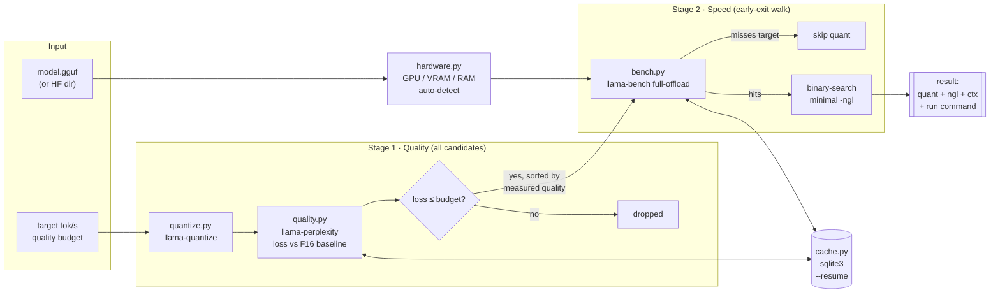

<div align="center">

[English](README.md) | **한국어**

# 🎯 FiTuna

**llama.cpp 설정, 추측하지 말고 측정하세요.**

*하드웨어 실측 벤치마크 기반 로컬 LLM 자동 튜닝 도구 — 모델, 목표 속도, 허용
품질손실을 입력하면 **당신의 기기**에서 실제로 그 수치를 달성하는 가장
가벼운 설정을 찾아 돌려줍니다.*

[](https://github.com/leeyunseokarchive/fituna/actions/workflows/ci.yml)
[](LICENSE)
[](https://www.python.org/downloads/)
[](docs/SBOM.md)
[](CONTRIBUTING.md)

**심사위원 · 검증기관용 한국어 재현 가이드 → [REVIEWERS.md](REVIEWERS.md)**
*(이 문서는 프로젝트 전체를 설명하는 소개 문서이고, REVIEWERS.md는 직접
구동·검증하는 절차만 다루는 별도 문서입니다.)*

</div>

---

```bash
$ fituna run --model Qwen3-4B-Instruct-2507-F16.gguf \
    --target-tps 30 --max-quality-loss 5 --ctx 4096 --wikitext wiki.txt --out ./out

[Q6_K]   full-offload 28.48 tok/s < target 30.00, skipping (early-exit B)
[Q8_0]   full-offload 24.22 tok/s < target 30.00, skipping (early-exit B)
[Q5_K_M] full-offload 29.59 tok/s < target 30.00, skipping (early-exit B)
[Q4_K_M] found ngl=33 meeting target -- done

FiTuna result: MEETS TARGET
  quant : Q4_K_M   ngl : 33   ctx : 4096
  gen tok/s : 30.81      quality loss : 1.73%

  artifact: out/Qwen3-4B-Instruct-2507-...-Q4_K_M.gguf  (2.3 GB -- already produced during the search)

  1) local API server (OpenAI-compatible):
       llama-server -m out/Qwen3-...-Q4_K_M.gguf -ngl 33 -c 4096 --port 8080
  2) import into Ollama: re-run with --export-ollama to write a Modelfile beside the artifact
  3) terminal chat (interactive check):
       llama-cli -m out/Qwen3-...-Q4_K_M.gguf -ngl 33 -c 4096
```

실제로 Apple M3 Pro에서 돌린 결과입니다([전체 로그](docs/RESULTS.md)). 무엇이
일어났는지 보세요: "당연히 가장 좋을" Q8_0이 속도 목표에서 **탈락**했고,
Q5_K_M은 **0.41 tok/s** 차이로 목표를 놓쳤으며, 답은 양자화 레벨 하나가
아니라 그 양자화 *플러스* 최소 GPU 오프로드(전체 36이 아닌 `-ngl 33`)였습니다.
이 중 어느 것도 사양표만으로는 예측할 수 없습니다. 그래서 FiTuna는 측정합니다.

## 왜 필요한가

로컬 LLM을 돌리려면 양자화 레벨(Q2–Q8), GPU 오프로드 레이어 수(`-ngl`),
컨텍스트 길이를 정해야 합니다 — 지금은 대부분 시행착오로 이 탐색 공간을
찾아갑니다:

- **Ollama / LM Studio**는 모델별 고정 프리셋을 적용합니다. 더 세밀한 양자화
  제어를 요청한 이슈는 ["Closed as not planned"](https://github.com/ollama/ollama/issues/14674)로
  종료됐습니다.
- **NVIDIA Model Optimizer**의 AutoQuantize는 CUDA 전용입니다.
- **VRAM 계산기·챗봇 조언**은 사양표에서 추정합니다 — 사양표는 당신 기기의
  발열 상태, 메모리 대역폭, llama.cpp 빌드 플래그를 모릅니다.

FiTuna는 추측 대신 실측 탐색으로 대체합니다. 이미 설치된 llama.cpp
바이너리(`llama-quantize`, `llama-bench`, `llama-perplexity`)를 오케스트레이션해
목표를 만족하는 설정을 찾습니다 — 당신의 하드웨어에서 검증되고, 캐시에서
재현됩니다.

## 기능

- 🔍 **목표 기반 탐색** — 입력: 모델 + 목표 tok/s + 허용 품질손실 %.
  출력: quant × `-ngl` × ctx 설정 + 바로 실행 가능한 명령어.
- 📏 **가정이 아닌 실측** — 후보를 *실측* perplexity 순서로 걷습니다(우리
  실험에서는 Q6_K가 Q8_0을 이겼습니다 — [데이터 보기](docs/RESULTS.md)).
  최소 GPU 오프로드는 이진탐색으로 찾습니다.
- ⚡ **공격적인 조기종료** — 품질 게이트 탈락·가망 없는 quant는 벤치마크를
  낭비하지 않고 건너뜁니다. 시간 안에 안 끝나는 벤치는 "너무 느림"으로
  처리하지, 크래시로 처리하지 않습니다.
- 🗃️ **재현 가능한 캐시** — 모델 지문 × 하드웨어 × llama.cpp 빌드 버전으로
  키잉된 sqlite3 결과. `--resume`은 1초 미만으로 재응답하며 중단에도
  살아남습니다.
- 🖥️ **하드웨어 자동 감지** — NVIDIA(`nvidia-smi`), AMD(`rocm-smi`),
  Apple Silicon 통합메모리(`system_profiler`), 수동 오버라이드 지원.
- 🪶 **런타임 의존성 0개** — 순수 Python 3.11+ 표준 라이브러리. `pip
  install`만 하면 바로 씁니다.

## 빠른 시작

**1. llama.cpp 설치** (실제 양자화/벤치/perplexity 엔진 제공):

```bash
brew install llama.cpp        # macOS/Linux Homebrew — 필요한 바이너리 전부 포함
# 또는 소스 빌드(모든 플랫폼):
git clone https://github.com/ggml-org/llama.cpp
cmake -S llama.cpp -B llama.cpp/build && cmake --build llama.cpp/build --config Release
```

**2. FiTuna 설치** (Python 3.11+로 만든 가상환경에 — macOS 시스템
`python3`는 3.9입니다):

```bash
git clone https://github.com/leeyunseokarchive/fituna
python3.13 -m venv .venv && source .venv/bin/activate
pip install -e fituna
```

**3. 품질 평가용 코퍼스 준비.** 품질손실은 평문 텍스트 코퍼스에 대한
perplexity 증가율로 측정되며, 실제 사용할 텍스트와 비슷할 때만 의미가
있습니다. UTF-8 텍스트 파일이면 무엇이든 됩니다(`--quality-corpus`).

```bash
fituna fetch-corpus --lang en --out wikitext-2-raw-test.txt        # wikitext-2 test split
fituna fetch-corpus --lang ko --out kowiki-corpus.txt --rows 500   # 한국어 위키백과
```

HuggingFace 공개 dataset-viewer REST API에서 표준 라이브러리 `urllib`로 직접
행을 받아옵니다 — `pip install datasets`(pyarrow/pandas를 끌고 옴)가
필요 없습니다. 한국어 모델은 한국어 코퍼스를 써야 품질 게이트가 실제
한국어 사용자에게 무엇이 저하되는지를 측정합니다 — 같은 quant도 두
코퍼스에서 2~3배 다른 손실을 보이며, Run 3에서는 그 차이만으로 도구가
반환하는 판정이 바뀌었습니다. (그 차이를 만든 0.96%p는 32청크 추정치가
갖는 오차범위 안에 있습니다 — 그래서 "어느 코퍼스로 게이트하느냐가 답을
정한다"는 사실은 맞지만, 그 근저의 품질 차이 자체가 통계적으로 확정됐다고는
주장하지 않습니다. [Run 3 단서 조항 참고](docs/RESULTS.md#run-3--english-vs-korean-quality-corpus-same-model-same-quants).)
당신이 실제로 쓸 언어로 측정하세요. 두 프리셋 모두 CC BY-SA 3.0이며,
`fetch-corpus`는 완료 시 저작자표시·동일조건변경허락 고지와 출처 URL을
표준출력에 출력합니다. 직접 준비한 데이터셋이 있다면 `--dataset/--config/--split`로
프리셋을 오버라이드할 수 있습니다(`fituna fetch-corpus --help`).

**4. 실행:**

```bash
fituna doctor                             # 환경이 준비됐는지 확인
fituna detect-hw                          # FiTuna가 무엇을 감지하는지 확인
fituna run --model your-model-F16.gguf \
  --target-tps 30 --max-quality-loss 5 \
  --ctx 4096 --wikitext wikitext-2-raw-test.txt --out ./out --resume
```

F16/BF16 `.gguf`를 직접 넘기거나(많은 모델이 이미 공개함), HF 포맷
디렉토리를 넘길 수도 있습니다(`convert_hf_to_gguf.py`가 있는 경우 —
소스 체크아웃 + `pip install torch transformers` 필요, 패키지 매니저
빌드에는 포함되지 않음).

> **디스크 사용량:** 탐색은 품질 단계에 도달한 모든 후보를 양자화합니다 —
> 4B 모델의 후보 4개 기준 약 12 GB. 파일은 재실행 시 재사용되며,
> `--quant`로 후보를 좁히면 이 용량을 제한할 수 있습니다.

## 동작 원리



**1단계**는 *모든* 후보의 perplexity 손실을 측정합니다 — 2단계가 후보를
**실측** 품질 순서로 걷기 때문이며, 측정하지 않은 숫자로는 정렬할 수 없기
때문입니다. (실제로 두 테스트 모델 모두에서 통념상의 Q8_0 우선 순위가
틀렸습니다.) **2단계**는 강하게 조기종료합니다: 풀오프로드 벤치가 목표를
놓친 quant는 추가 벤치 없이 탈락하고, 통과하는 첫 quant가 승자가 됩니다 —
그보다 낮은 품질의 quant는 벤치마크조차 되지 않습니다.

모든 서브프로세스 결과는 모델 지문 × 하드웨어 프로파일 × **llama.cpp 빌드
버전**으로 키잉된 sqlite3 캐시에 저장됩니다 — 그래서 `--resume`이 다른
백엔드 빌드에서 측정한 수치를 절대 재사용하지 않습니다.

설계 상세: [docs/ARCHITECTURE.md](docs/ARCHITECTURE.md) · 인터페이스 계약:
[`fituna/config.py`](fituna/config.py)

## 실측 결과

| 모델 | 목표 | "당연한" 선택이 한 일 | FiTuna가 찾은 것 |
|---|---|---|---|
| Qwen3-4B-Instruct (Apache 2.0) | 30 tok/s, ≤5% 손실 | Q8_0: 24.22 tok/s ❌ (게다가 Q6_K보다 *더 나쁜* 품질로 측정됨) | **Q4_K_M @ ngl=33 → 30.81 tok/s, 1.73% 손실** ✅ |
| SmolLM2-135M (Apache 2.0) | 240 tok/s, ≤5% 손실 | Q8_0: 205.91 tok/s ❌ | **Q6_K → 249.50 tok/s, 0.53% 손실** ✅ (게다가 Q4_K_M이 Q6_K보다 *더 느리게* 측정됨) |
| Midm-2.0-Mini-Instruct, 한국어 (MIT) | 40 tok/s, ≤5% 손실 | Q8_0: 34.26 tok/s ❌ | **Q4_K_M @ ngl=48 → 44.62 tok/s, 2.58% 손실** ✅ (두 코퍼스가 Q6_K/Q5_K_M의 중간 순위를 다르게 보고하지만, 청크별 트레이스를 보면 — 125개 지점은 독립 시행이 아니라 중첩·자기상관된 관측치입니다 — 영어 쪽 순서는 부호가 한 번도 바뀌지 않는 반면 한국어 쪽은 n=16 이후 아홉 번(n=4부터 세면 열 번) 부호가 바뀝니다 — 그래서 코퍼스가 순위를 바꿨다는 주장은 [입증할 수 없었습니다](docs/RESULTS.md#how-big-is-a-perplexity-gap-the-error-bar-we-had-been-discarding)) |

환경: Apple M3 Pro, llama.cpp build 9960. 전체 로그·소요시간·재실행 변동성
분석(직접 발견해 기록한 서멀 스로틀 이상치 포함): **[docs/RESULTS.md](docs/RESULTS.md)**
· 사용 시나리오: [docs/USE_CASES.md](docs/USE_CASES.md)

NVIDIA/Linux에서 직접 재현하기 — 원클릭 Colab 노트북(무료 T4 티어):
[notebooks/colab_nvidia_verification.ipynb](notebooks/colab_nvidia_verification.ipynb)
[](https://colab.research.google.com/github/leeyunseokarchive/fituna/blob/main/notebooks/colab_nvidia_verification.ipynb)

## MCP 서버 — AI 에이전트를 위한 실측 답변

챗봇에게 "내 컴퓨터에 맞는 로컬 모델 설정이 뭐야?"라고 물으면 사양표에서
추측합니다. FiTuna의 MCP 서버를 연결하면 *측정*합니다:

```bash
claude mcp add fituna -- fituna-mcp      # 또는 stdio transport를 지원하는 모든 MCP 클라이언트
```

노출되는 도구:

| 도구 | 하는 일 |
|---|---|
| `fituna_detect_hardware` | FiTuna가 감지한 GPU 벤더/이름, VRAM, CPU 코어, RAM |
| `fituna_recommend` | 목표 스펙에 대해 실측 탐색을 실행합니다. 승자 설정, 실측 tok/s, 실측 품질손실, 바로 실행 가능한 명령어를 반환합니다. 처음엔 느리고, 재요청 시 ~1초(캐시). |

이 서버도 FiTuna의 나머지 부분처럼 표준 라이브러리만 사용합니다 — MCP
stdio transport는 줄바꿈으로 구분된 JSON-RPC 2.0이라 별도 SDK가 필요
없습니다([`fituna/mcp_server.py`](fituna/mcp_server.py)).

## 프로젝트 구조

```
fituna/
├── cli.py         # argparse 진입점, 종료코드 매핑(0/1/2/3)
├── config.py      # frozen-dataclass 인터페이스 계약(단일 진실 공급원)
├── hardware.py    # GPU/VRAM/CPU/RAM 자동 감지 + 수동 오버라이드
├── binaries.py    # llama.cpp 바이너리 탐색 + 기능 조회
├── doctor.py      # 환경 자가진단(fituna doctor 서브커맨드)
├── corpus.py      # 품질 코퍼스 다운로드(fituna fetch-corpus, stdlib urllib)
├── errors.py      # FiTunaError 계층 재수출 shim(정의는 config.py)
├── mcp_server.py  # MCP stdio 서버(JSON-RPC 2.0, fituna-mcp 진입점)
├── model_info.py  # GGUF 헤더 직접 파싱(struct), HF 디렉토리 변환
├── quantize.py    # llama-quantize 래퍼(멱등, 원자적 쓰기)
├── quality.py     # llama-perplexity 래퍼(품질손실 측정)
├── bench.py       # llama-bench 래퍼(처리량 측정)
├── search.py      # 2단계 탐색 오케스트레이터
├── cache.py       # sqlite3 결과 캐시(--resume)
└── report.py      # 사람/JSON 결과 렌더링 + 실행 명령어 생성
```

유닛 테스트 178개(서브프로세스/네트워크 계층 모킹) + 모듈별 실행 가능한
self-check + 3-OS × 2-Python CI 매트릭스. 실기 E2E 검증은 macOS(Apple
Silicon/Metal)와 Linux(NVIDIA T4/CUDA)에서 수행됨; [알려진 한계](#알려진-한계)
참고.

## 로드맵

- [x] **MCP 서버** — AI 코딩 에이전트가 사양 추측 대신 실측 기반 로컬 모델
  추천을 받음(`fituna-mcp`)
- [x] **한국어 캘리브레이션 코퍼스 옵션** — `--quality-corpus`는 어떤
  언어의 텍스트로도 게이트할 수 있습니다. EN-vs-KO 실측 비교는 코퍼스만
  바꿔도 실행 가능성 판정이 뒤집힐 수 있음을 보여줍니다(같은 두 명령이
  실제로 서로 다른 판정을 냈다는 사실은 맞지만, 그 판정을 가른 품질 차이
  자체는 추정치의 분해능 안에 있으므로 "어느 코퍼스로 게이트하느냐가
  판정을 정한다"로 읽어야지, 한 언어가 손실이 더 적다는 증명으로 읽으면
  안 됩니다)
  ([데이터](docs/RESULTS.md#run-3--english-vs-korean-quality-corpus-same-model-same-quants))
- [x] NVIDIA/Linux 실측(Colab 노트북의 Tesla T4 —
  [Run 4](docs/RESULTS.md#run-4--nvidia-tesla-t4-linux-google-colab):
  품질 게이트 판정 자체가 Metal과 CUDA 사이에서 뒤집힘)
- [ ] llama-bench 표준편차([#9](https://github.com/leeyunseokarchive/fituna/issues/9))
  *및* llama-perplexity의 `+/-` 표준오차
  ([#8](https://github.com/leeyunseokarchive/fituna/issues/8))를 노출해
  경계선 판정을 자동으로 플래그 — `quality.py`는 현재 PPL만 파싱하고
  오차범위는 버립니다. 이게 Run 5가 결국 철회해야 했던 주장을 발표하게 된
  경위입니다
- [ ] 멀티 GPU `--tensor-split` 지원
  ([#11](https://github.com/leeyunseokarchive/fituna/issues/11) — 도움
  필요: 실측할 멀티 GPU 기기가 없습니다)
- [ ] Windows 실기 검증
  ([#12](https://github.com/leeyunseokarchive/fituna/issues/12) — CI는
  거기서 돌지만, 실제 llama.cpp 바이너리로는 아직 아무것도 실행해보지
  않았습니다)

위 항목 전부 [v0.2.0 마일스톤](https://github.com/leeyunseokarchive/fituna/milestone/1)에서
추적됩니다. 그 외 작은 항목들도 함께 있습니다 — llama.cpp 출력 파서에 대한
pytest 커버리지([#10](https://github.com/leeyunseokarchive/fituna/issues/10),
good first issue)와 `--ppl-chunks`가 품질 수치를 어떻게 움직이는지 문서화
([#13](https://github.com/leeyunseokarchive/fituna/issues/13)).

## 범위

FiTuna는 추천만 합니다 — 실행하거나 서빙하지 않습니다. 출력은 양자화된
`.gguf` 산출물과, 복사해서 직접 돌리는 `llama-server`·`llama-cli`
명령어입니다(`--export-ollama`를 쓰면 그 옆에 Ollama `Modelfile`도
생성합니다). FiTuna는 그중 어느 것도 실행하지 않고, 자체 추론 서버도
띄우지 않습니다.

이건 빠뜨린 게 아니라 **의도적인 경계선**입니다. 실제로 추론을 서빙하는
건 llama.cpp의 일이고(Ollama의 일이고, LM Studio의 일입니다), 그걸
중복 구현하면 이 문서가 위에서 대조하는 바로 그 도구들과 경쟁하게 되는데,
차별화되는 가치는 없습니다 — FiTuna의 유일한 주장은 "탐색이 추측이 아닌
실측"이라는 것뿐입니다. 서버 프로세스를 추가하면 런타임 의존성 0개라는
설계와도 어울리지 않습니다.

이 중 Ollama 쪽은 이제 구현되었습니다(`--export-ollama`가 실측한
`num_gpu`/`num_ctx`를 Modelfile에 써 줍니다 — 두 도구 모두 그러지 않으면
모델별 고정 프리셋을 적용합니다,
[위에서 인용한 바로 그 공백](https://github.com/ollama/ollama/issues/14674)).
이 경계선 안에 머무르면서도 확장할 수 있는 나머지 두 가지는
[#19](https://github.com/leeyunseokarchive/fituna/issues/19)에서 계속 추적
중입니다: 찾아낸 명령을 직접 실행하는 것(`--launch`), 그리고 LM Studio
프리셋으로 내보내는 것. MCP
서버는 이미 "추천 이후에 무슨 일이 일어나는가"의 에이전트 버전을 다루고
있습니다 — 에이전트가 `fituna_recommend`의 답을 읽고 스스로 판단합니다.
사람이 명령을 복사할 필요가 없습니다.

## 알려진 한계

- **단일 GPU만 지원** — `nvidia-smi`/`rocm-smi`가 보고하는 첫 GPU만 사용.
  `--tensor-split` 없음.
- **Windows AMD 자동 감지** — `rocm-smi`는 Windows에 주류 배포판이 없음.
  `--gpu amd --vram-mb <N>` 사용.
- **품질 = 선택한 코퍼스에 대한 perplexity** — 대리 지표일 뿐, 도메인
  품질을 보장하지 않습니다. 실제 작업과 비슷한 텍스트로 게이트하세요
  (`--quality-corpus`; 실측 EN-vs-KO 비교 — 판정은 실제로 뒤집혔지만
  근저 차이는 추정치 분해능 안 — [docs/RESULTS.md](docs/RESULTS.md)).
- **품질 판정은 `--ppl-chunks`에 의존합니다** — perplexity 손실은
  `chunks × 512` 토큰에 대한 추정치이며, 절대값은 청크 수가 늘수록
  커집니다(실측: 같은 한국어 Q4_K_M이 32청크에서 2.58%, 128청크에서
  4.08%를 기록해 5% 게이트 대비 여유가 2.42%p에서 0.92%p로 줄어듦).
  예산에 가까운 후보는 더 많은 청크로 재측정한 뒤 PASS를 신뢰해야 합니다.
  [docs/RESULTS.md](docs/RESULTS.md) 참고.
- **벤치마크는 발열에 민감합니다** — 목표와 몇 tok/s 차이인 판정은
  경계선입니다. [변동성 분석](docs/RESULTS.md#run-to-run-variance-measured-not-hidden)
  참고.
- 실기 E2E: macOS(Apple Silicon/Metal)와 Linux(NVIDIA T4/CUDA, Colab
  노트북 경유). Windows 경로는 단위테스트·CI로는 검증됐지만 아직 실제
  바이너리로 통합 실행하지 않았습니다.

## 기여하기

기여를 환영합니다 — 코드베이스는 작고, 의존성이 없으며, 계약 우선으로
설계됐습니다([`fituna/config.py`](fituna/config.py)에서 시작하세요). 자세한
내용은 [CONTRIBUTING.md](CONTRIBUTING.md), 개발 방법론은
[docs/DEVELOPMENT.md](docs/DEVELOPMENT.md), 릴리스 이력은
[CHANGELOG.md](CHANGELOG.md), 취약점 신고는 [SECURITY.md](SECURITY.md)를
참고하세요.

## 라이선스

[MIT](LICENSE) © FiTuna contributors. 제3자 고지(llama.cpp 및
서브프로세스로 호출되는 도구들): [THIRD_PARTY_NOTICES.md](THIRD_PARTY_NOTICES.md)
· SBOM: [docs/SBOM.md](docs/SBOM.md) · AI 활용 개발 공개:
[docs/AI_MODEL_USAGE.md](docs/AI_MODEL_USAGE.md)
