<div align="center">

[English](README.md) | **한국어**

# 🎯 FiTuna

**llama.cpp 설정, 추측하지 말고 측정하세요.**

하드웨어 실측 벤치마크 기반 로컬 LLM 자동 튜닝 도구 — 모델, 목표 속도,
허용 품질손실을 입력하면 **당신의 기기**에서 실제로 그 수치를 달성하는 가장
가벼운 llama.cpp 설정을 찾아 돌려줍니다.

**외부 API는 구독료가 쌓이고, 로컬 LLM은 어떤 모델을 돌려야 할지
막막하죠?** 추측하지 마세요 — 실측으로 검증하고, 나만의 LLM을 돌리세요.

[](https://github.com/leeyunseokarchive/fituna/actions/workflows/ci.yml)
[](https://pypi.org/project/fituna/)
[](LICENSE)
[](https://www.python.org/downloads/)
[](docs/SBOM.md)
[](CONTRIBUTING.md)

**심사위원 · 검증기관용 한국어 재현 가이드 → [REVIEWERS.md](REVIEWERS.md)** *(이 문서는 프로젝트 전체를 설명하는 소개 문서이고, REVIEWERS.md는 직접 구동·검증하는 절차만 다루는 별도 문서입니다.)*

</div>

---

```bash
$ fituna run --model Qwen3-4B-Instruct-2507-F16.gguf \
    --target-tps 30 --max-quality-loss 5 --ctx 4096 --wikitext wiki.txt --out ./out

[Q6_K]   full-offload 28.48 tok/s < target 30.00, skipping (early-exit B)
[Q8_0]   full-offload 24.22 tok/s < target 30.00, skipping (early-exit B)
[Q5_K_M] full-offload 29.59 tok/s < target 30.00, skipping (early-exit B)
[Q4_K_M] found ngl=33 meeting target -- done

FiTuna result: MEETS TARGET
  quant : Q4_K_M   ngl : 33   ctx : 4096
  gen tok/s : 30.81      quality loss : 1.73%

  artifact: out/Qwen3-4B-Instruct-2507-...-Q4_K_M.gguf  (2.3 GB -- already produced during the search)

  1) local API server (OpenAI-compatible):
       llama-server -m out/Qwen3-...-Q4_K_M.gguf -ngl 33 -c 4096 --port 8080
  2) import into Ollama: re-run with --export-ollama to write a Modelfile beside the artifact
  3) terminal chat (interactive check):
       llama-cli -m out/Qwen3-...-Q4_K_M.gguf -ngl 33 -c 4096
```

*(출력 형식은 현재 버전 기준 재구성, 수치는 Run 2 실측입니다.)*

실제로 Apple M3 Pro에서 돌린 결과입니다. "당연히 가장 좋을" Q8_0이 속도
목표에서 **탈락**했고, Q5_K_M은 0.41 tok/s 차이로 놓쳤습니다. 답은 양자화
하나가 아니라 양자화에 최소 GPU 오프로드(전체 36이 아닌 `-ngl 33`)를 더한
조합이었고, 사양표만으로는 어느 것도 예측할 수 없었습니다([전체
로그](docs/RESULTS.md)).

## 2분 체험



258 MB 모델로 실측 탐색 전 과정(다운로드 → 후보 6종 양자화 → 품질 게이트 →
벤치마크)을 돌려볼 수 있습니다. M 시리즈 Mac 기준 1분 남짓이면 끝납니다:

```bash
pip install fituna            # Python 3.11+ (macOS 시스템 python3는 3.9 — python3.13 -m venv 먼저)
brew install llama.cpp        # FiTuna가 구동하는 엔진. 다른 플랫폼은 아래 소스 빌드 참고
fituna fetch-corpus --lang en --out wiki.txt
fituna run --hf bartowski/SmolLM2-135M-Instruct-GGUF \
  --target-tps 240 --max-quality-loss 5 --ctx 2048 --wikitext wiki.txt --out ./out
```

같은 M3 Pro에서 위 명령을 그대로 다시 실행한 결과: **콜드런 58초**, 판정
`MEETS TARGET — Q8_0 @ ngl=24, 249.16 tok/s, 손실 0.29%`, 산출물과 바로 쓸
`llama-server` 명령까지 출력. `--resume` 재실행은 캐시에서 **0.8초**에 같은
답을 냈습니다. (공개된 Run 1은 같은 모델·같은 목표인데 코퍼스 스냅샷이 달라
Q6_K를 먼저 측정했습니다 — 실측 품질 순서가 벤치 순서를 정하고, 이게 바로
가정 대신 측정이 필요한 이유입니다.)

## 설치

```bash
pip install fituna
```

[PyPI](https://pypi.org/project/fituna/)에서 받으며 런타임 의존성은 없습니다.
Python 3.11+가 필요합니다(macOS 시스템 `python3`는 3.9 — `python3.13`으로
가상환경을 만드세요). 개발용은 git에서 설치하세요:

```bash
git clone https://github.com/leeyunseokarchive/fituna
python3.13 -m venv .venv && source .venv/bin/activate
pip install -e fituna
```

FiTuna가 오케스트레이션하는 양자화/벤치/perplexity 엔진을 제공하는
llama.cpp도 필요합니다:

```bash
brew install llama.cpp        # macOS/Linux Homebrew — 필요한 바이너리 전부 포함
# 또는 소스 빌드(모든 플랫폼):
git clone https://github.com/ggml-org/llama.cpp
cmake -S llama.cpp -B llama.cpp/build && cmake --build llama.cpp/build --config Release
```

## 빠른 시작

들어오는 길은 세 가지입니다: 사람은 마법사를 실행하고, 스크립트나 CI는
`fituna run --json`을 호출하고, AI 에이전트는
[`fituna-mcp`](#mcp-서버--ai-에이전트를-위한-실측-답변)와 대화합니다.

```bash
fituna quickstart
```

6단계 — 환경 점검, 목표 설정, 라이선스 조건, 모델, 품질 코퍼스, 탐색 실행 —
이고, 완성된 `fituna run ...` 명령을 **실행 전에** 그대로 보여주므로 다음부터는
그 한 줄만 쓰면 됩니다. 터미널(TTY)이 필요하며, CI나 파이프에서는 `fituna run`을
직접 쓰세요. 탐색 파라미터는 모두 공개된 `run` 플래그로 표현됩니다(argv 일치
테스트로 증명). 마법사에는 검증된 추천 목록과 대화형 HuggingFace 검색이
있고, 스크립트 경로에서는 `run --model`이 디스크의 `.gguf`를 받거나
`run --hf repo[:filename]`이 F16/BF16 GGUF를 먼저 내려받습니다(TTY 불필요 —
저장소에 F16 파일이 없거나 여러 개면 추측하지 않고 목록을 보여주며, API가
라이선스를 보고하면 함께 출력합니다).

속도는 예측하지 않습니다: 메모리 적합 여부만 산술(공개된 파일 크기 vs 감지된
VRAM/RAM, 가정한 여유분 명시)로 판단하고, 속도는 측정하며, 추천 목록·HuggingFace
검색 후보는 라이선스를 함께 표시합니다 — 로컬 스캔·직접 경로 입력 항목은
표시할 수 없습니다(`.gguf` 파일에는 라이선스 메타데이터가 없습니다). 인용되는
[`docs/RESULTS.md`](docs/RESULTS.md) 수치는 "특정 하드웨어에서 이렇게
측정됐다"는 기록이지 예측이 아닙니다.

### 스크립트 경로 (마법사가 대신 조립해 주는 것)

품질손실은 평문 텍스트 코퍼스에 대한 perplexity 증가율이므로, 실제 사용할
텍스트와 비슷할 때만 의미가 있습니다. UTF-8 파일이면 무엇이든 됩니다
(`--quality-corpus`). 두 프리셋은 명령 하나로 받습니다:

```bash
fituna fetch-corpus --lang en --out wikitext-2-raw-test.txt        # wikitext-2 test split
fituna fetch-corpus --lang ko --out kowiki-corpus.txt --rows 500   # 한국어 위키백과
```

실제로 쓸 언어로 측정하세요: 같은 quant도 두 코퍼스에서 2~3배 다른 손실을
보이며, Run 3에서는 그 차이만으로 도구가 반환하는 판정이 바뀌었습니다([실측
내용과 단서
조항](docs/RESULTS.md#run-3--english-vs-korean-quality-corpus-same-model-same-quants)).
두 프리셋 모두 CC BY-SA 3.0이며 `fetch-corpus`는 완료 시 라이선스 고지와
출처 URL을 출력합니다. `--dataset/--config/--split`로 프리셋을 오버라이드할 수 있습니다
([출처와 라이선스](docs/OPEN_SOURCE_USAGE.md)).

```bash
fituna doctor                             # 환경이 준비됐는지 확인
fituna detect-hw                          # FiTuna가 무엇을 감지하는지 확인
fituna run --model your-model-F16.gguf \
  --target-tps 30 --max-quality-loss 5 \
  --ctx 4096 --wikitext wikitext-2-raw-test.txt --out ./out --resume
```

F16/BF16 `.gguf`를 직접 넘기거나(많은 모델이 이미 공개함), HF 포맷 디렉토리를
넘길 수도 있습니다(`convert_hf_to_gguf.py`가 있는 경우 — 소스 체크아웃 +
`pip install torch transformers` 필요, 패키지 매니저 빌드에는 미포함).

> **디스크 사용량:** 탐색은 품질 단계에 도달한 모든 후보를 양자화합니다 —
> 4B 모델의 후보 4개 기준 약 12 GB. 파일은 재실행 시 재사용되며, `--quant`로
> 후보를 좁히면 이 용량을 제한할 수 있습니다.

## 왜 필요한가

로컬 LLM을 돌리려면 양자화 레벨(Q2–Q8), GPU 오프로드 레이어 수(`-ngl`),
컨텍스트 길이를 정해야 합니다 — 지금은 대부분 시행착오로 이 탐색 공간을
찾아갑니다:

- **Ollama / LM Studio**는 모델별 고정 프리셋을 적용합니다. 더 세밀한 양자화
  제어 요청은 ["Closed as not planned"](https://github.com/ollama/ollama/issues/14674)로
  종료됐습니다.
- **NVIDIA Model Optimizer**의 AutoQuantize는 CUDA 전용입니다.
- **VRAM 계산기·챗봇 조언**은 사양표에서 추정합니다 — 사양표는 당신 기기의
  발열 상태, 메모리 대역폭, llama.cpp 빌드 플래그를 모릅니다.

FiTuna는 이미 설치된 llama.cpp 바이너리 위에서의 실측 탐색으로 추측을
대체합니다 — 당신의 하드웨어에서 검증되고, 캐시에서 재현됩니다.

## 기능

- 🔍 **목표 기반 탐색** — 입력: 모델 + 목표 tok/s + 허용 품질손실 %.
  출력: quant × `-ngl` × ctx 설정 + 바로 실행 가능한 명령어.
- 📏 **가정이 아닌 실측** — 후보를 *실측* perplexity 순서로 걷고(우리
  실험에서는 Q6_K가 Q8_0을 이겼습니다 — [데이터](docs/RESULTS.md)), 최소 GPU
  오프로드는 이진탐색으로 찾습니다.
- ⚡ **공격적인 조기종료** — 품질 게이트 탈락·가망 없는 quant는 벤치마크를
  낭비하지 않고 건너뜁니다. 시간 안에 안 끝나는 벤치는 "너무 느림"으로
  처리하지, 크래시로 처리하지 않습니다.
- 🗃️ **재현 가능한 캐시** — sqlite3, 모델 지문 × 하드웨어 × llama.cpp 빌드
  버전으로 키잉. `--resume`은 1초 미만으로 재응답하며 중단에도 살아남습니다.
- 🖥️ **하드웨어 자동 감지** — NVIDIA(`nvidia-smi`), AMD(`rocm-smi`),
  Apple Silicon 통합메모리(`system_profiler`), 수동 오버라이드 지원.
- 🪶 **런타임 의존성 0개** — 순수 Python 3.11+ 표준 라이브러리.

## 실측 결과

| 모델 | 목표 | "당연한" 선택이 한 일 | FiTuna가 찾은 것 |
|---|---|---|---|
| Qwen3-4B-Instruct (Apache 2.0) | 30 tok/s, ≤5% 손실 | Q8_0: 24.22 tok/s ❌ (게다가 Q6_K보다 *더 나쁜* 품질로 측정됨) | **Q4_K_M @ ngl=33 → 30.81 tok/s, 1.73% 손실** ✅ |
| SmolLM2-135M (Apache 2.0) | 240 tok/s, ≤5% 손실 | Q8_0: 205.91 tok/s ❌ | **Q6_K → 249.50 tok/s, 0.53% 손실** ✅ (게다가 Q4_K_M이 Q6_K보다 *더 느리게* 측정됨) |
| Midm-2.0-Mini-Instruct, 한국어 (MIT) | 40 tok/s, ≤5% 손실 | Q8_0: 34.26 tok/s ❌ | **Q4_K_M @ ngl=48 → 44.62 tok/s, 2.58% 손실** ✅ (두 코퍼스가 중간 순위를 다르게 보고하지만, 청크별 트레이스를 보면 그 순위 변화는 [입증할 수 없었습니다](docs/RESULTS.md#how-big-is-a-perplexity-gap-the-error-bar-we-had-been-discarding)) |

Apple M3 Pro, llama.cpp build 9960. 전체 로그·소요시간·재실행 변동성
분석(직접 발견해 기록한 서멀 스로틀 이상치 포함):
**[docs/RESULTS.md](docs/RESULTS.md)** · 사용 시나리오:
[docs/USE_CASES.md](docs/USE_CASES.md) · NVIDIA/Linux에서 직접 재현하려면
원클릭 Colab 노트북(무료 T4 티어):
[notebooks/colab_nvidia_verification.ipynb](notebooks/colab_nvidia_verification.ipynb)
[](https://colab.research.google.com/github/leeyunseokarchive/fituna/blob/main/notebooks/colab_nvidia_verification.ipynb)

## 동작 원리

**1단계**는 *모든* 후보의 perplexity 손실을 측정합니다. **2단계**가 후보를
*실측* 품질 순서로 걷는데, 측정하지 않은 숫자로는 정렬할 수 없기 때문입니다.
2단계는 강하게 조기종료합니다: 풀오프로드에서 목표를 놓친 quant는 추가 벤치
없이 탈락하고, 통과하는 첫 quant가 승자입니다. 결과는 모델 지문 × 하드웨어
프로파일 × **llama.cpp 빌드 버전**으로 키잉된 sqlite3에 캐시되므로 `--resume`이
다른 백엔드 빌드의 수치를 재사용하지 않습니다. 다이어그램·모듈 지도·전체
알고리즘: [docs/ARCHITECTURE.md](docs/ARCHITECTURE.md) · 계약:
[`fituna/config.py`](fituna/config.py)

## 라이브러리로 사용하기

런타임 의존성이 0개라서 모듈을 바로 임포트해 쓸 수 있습니다:

```python
from fituna.hardware import detect_hardware

hw = detect_hardware()
print(f"{hw.gpu_vendor.value}: {hw.gpu_name}, {hw.vram_mb} MB VRAM, {hw.ram_mb} MB RAM")
# apple: Apple M3 Pro, 18432 MB VRAM, 18432 MB RAM
```

(위 실측 결과와 같은 M3 Pro에서 `python3.13 -c`로 실제 실행한 출력입니다.)
탐색을 코드로 돌리려면 `fituna.search.search()`를 호출하면 되며, 추가로
`ModelInfo`, 해석된 `BinaryPaths`, 작업 디렉토리, 코퍼스 경로가 필요합니다 —
바로 `fituna run`/`quickstart`가 대신 조립해 주는 것들입니다
([`search.py`](fituna/search.py), [`config.py`](fituna/config.py)).

## MCP 서버 — AI 에이전트를 위한 실측 답변

챗봇에게 "내 컴퓨터에 맞는 로컬 모델 설정이 뭐야?"라고 물으면 사양표에서
추측합니다. FiTuna의 MCP 서버를 연결하면 *측정*합니다:

```bash
claude mcp add fituna -- fituna-mcp      # 또는 stdio transport를 지원하는 모든 MCP 클라이언트
```

| 도구 | 하는 일 |
|---|---|
| `fituna_detect_hardware` | FiTuna가 감지한 GPU 벤더/이름, VRAM, CPU 코어, RAM |
| `fituna_recommend` | 목표 스펙에 대해 실측 탐색을 실행합니다. 승자 설정, 실측 tok/s, 실측 품질손실, 바로 실행 가능한 명령어를 반환합니다. 처음엔 느리고, 재요청 시 ~1초(캐시). |

나머지 부분처럼 표준 라이브러리만 씁니다 — MCP stdio는 줄바꿈으로 구분된
JSON-RPC 2.0이라 SDK가 필요 없습니다([`fituna/mcp_server.py`](fituna/mcp_server.py)).

## 범위

FiTuna는 추천만 합니다 — 실행하거나 서빙하지 않습니다. 출력은 양자화된 `.gguf`와
복사해서 직접 돌리는 `llama-server`·`llama-cli` 명령어이며(`--export-ollama`를
쓰면 그 옆에 Ollama `Modelfile`도 생성), FiTuna는 그중 어느 것도 실행하지
않습니다. 이건 **의도적인 경계선**입니다: 추론 서빙은 llama.cpp의 일이고, 중복
구현해도 차별화되는 가치가 없습니다([근거](docs/ARCHITECTURE.md#why-this-shape)).
경계선 안에 머무르는 두 확장 — `--launch`와 LM Studio 프리셋 내보내기 — 는
[#19](https://github.com/leeyunseokarchive/fituna/issues/19)에서 추적 중입니다.

## 알려진 한계

- **단일 GPU만 지원** — `nvidia-smi`/`rocm-smi`가 보고하는 첫 GPU만 사용,
  `--tensor-split` 없음
  ([#11](https://github.com/leeyunseokarchive/fituna/issues/11), 도움 필요:
  실측할 멀티 GPU 기기가 없습니다).
- **Windows AMD 자동 감지** — `rocm-smi`는 Windows에 주류 배포판이 없음.
  `--gpu amd --vram-mb <N>` 사용.
- **품질 = 선택한 코퍼스에 대한 perplexity** — 대리 지표일 뿐, 도메인 품질을
  보장하지 않습니다. 실제 작업과 비슷한 텍스트로 게이트하세요
  (`--quality-corpus`; [EN-vs-KO 실측
  비교](docs/RESULTS.md#run-3--english-vs-korean-quality-corpus-same-model-same-quants)).
- **품질 판정은 `--ppl-chunks`에 의존합니다** — 손실은 `chunks × 512` 토큰에
  대한 추정치이며 절대값이 청크 수에 따라 커지므로, 예산에 가까운 후보는
  재측정한 뒤 PASS를 신뢰하세요([실측된
  영향](docs/RESULTS.md#how-big-is-a-perplexity-gap-the-error-bar-we-had-been-discarding)).
  `quality.py`는 여전히 PPL만 파싱하고 llama-perplexity의 오차범위를 버립니다
  ([#8](https://github.com/leeyunseokarchive/fituna/issues/8)) — 이게 Run 5가
  결국 철회해야 했던 주장을 발표하게 된 경위입니다.
- **벤치마크는 발열에 민감합니다** — 목표와 몇 tok/s 차이인 판정은
  경계선입니다([변동성
  분석](docs/RESULTS.md#run-to-run-variance-measured-not-hidden)).
- **실기 E2E는 macOS와 Linux만 커버합니다** — Apple Silicon/Metal과 NVIDIA
  T4/CUDA. Windows 경로는 단위테스트·CI로는 검증됐지만 아직 실제 바이너리로
  통합 실행하지 않았습니다
  ([#12](https://github.com/leeyunseokarchive/fituna/issues/12)).

## 기여하기

기여를 환영합니다 — 코드베이스는 작고, 의존성이 없으며, 계약 우선으로
설계됐습니다([`fituna/config.py`](fituna/config.py)에서 시작하세요). 유닛 테스트
246개, 모듈별 self-check, 3-OS × 2-Python CI 매트릭스가 이를 지킵니다. 개발
로드맵(예정 작업)은 [v0.2.0 마일스톤](https://github.com/leeyunseokarchive/fituna/milestone/1)에
있으며, [#10](https://github.com/leeyunseokarchive/fituna/issues/10)(파서 테스트
커버리지, good first issue)도 포함됩니다. 자세한 내용은
[CONTRIBUTING.md](CONTRIBUTING.md) ·
[docs/DEVELOPMENT.md](docs/DEVELOPMENT.md) · [CHANGELOG.md](CHANGELOG.md) ·
[SECURITY.md](SECURITY.md).

## 라이선스

[MIT](LICENSE) © FiTuna contributors. 제3자 고지(llama.cpp 및 서브프로세스로
호출되는 도구들): [THIRD_PARTY_NOTICES.md](THIRD_PARTY_NOTICES.md) · SBOM:
[docs/SBOM.md](docs/SBOM.md) · 오픈소스 활용:
[docs/OPEN_SOURCE_USAGE.md](docs/OPEN_SOURCE_USAGE.md) · AI 활용 개발 공개:
[docs/AI_MODEL_USAGE.md](docs/AI_MODEL_USAGE.md)
