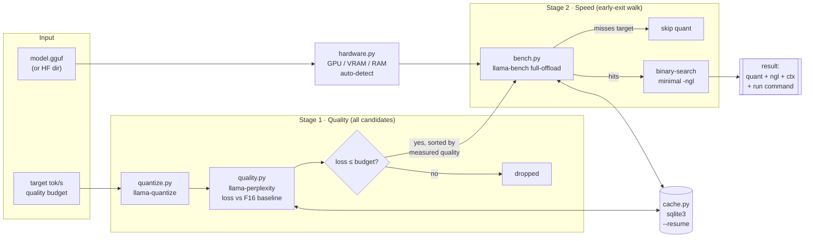

<div align="center">

# 🎯 FiTuna

**Stop guessing your llama.cpp config. Measure it.**

*Hardware-benchmark-driven auto-tuning for local LLMs — give it a model, a
target speed, and a quality budget; get back the smallest config that
actually hits the numbers on **your** machine.*

[](https://github.com/leeyunseokarchive/fituna/actions/workflows/ci.yml)
[](LICENSE)
[](https://www.python.org/downloads/)
[](docs/SBOM.md)
[](CONTRIBUTING.md)

</div>

---

```bash
$ fituna run --model Qwen3-4B-Instruct-2507-F16.gguf \
    --target-tps 30 --max-quality-loss 5 --ctx 4096 --wikitext wiki.txt --out ./out

[Q6_K]   full-offload 28.48 tok/s < target 30.00, skipping (early-exit B)
[Q8_0]   full-offload 24.22 tok/s < target 30.00, skipping (early-exit B)
[Q5_K_M] full-offload 29.59 tok/s < target 30.00, skipping (early-exit B)
[Q4_K_M] found ngl=33 meeting target -- done

FiTuna result: MEETS TARGET
  quant : Q4_K_M   ngl : 33   ctx : 4096
  gen tok/s : 30.81      quality loss : 1.73%
  run command:
    llama-cli -m out/Qwen3-4B-Instruct-2507-...-Q4_K_M.gguf -ngl 33 -c 4096
```

That's a real run (Apple M3 Pro — [full logs](docs/RESULTS.md)). Note what
happened: the "obviously best" Q8_0 **failed** the speed target, Q5_K_M missed
it by **0.41 tok/s**, and the answer wasn't just a quant — it was a quant
*plus* the minimal GPU offload (`-ngl 33`, not full 36). None of that is
predictable from a spec sheet. That's why FiTuna measures.

## Why

Running a local LLM means picking a quantization level (Q2–Q8), a GPU offload
layer count (`-ngl`), and a context length — a search space that people
navigate today by trial and error:

- **Ollama / LM Studio** apply fixed per-model presets; a request for finer
  quantization control was [closed as not planned](https://github.com/ollama/ollama/issues/14674).
- **NVIDIA Model Optimizer**'s AutoQuantize is CUDA-only.
- **VRAM calculators & chatbot advice** estimate from specs — and specs
  don't know your thermals, memory bandwidth, or llama.cpp build flags.

FiTuna replaces the guesswork with a measured search. It orchestrates the
llama.cpp binaries you already have (`llama-quantize`, `llama-bench`,
`llama-perplexity`) and finds the config that meets your target — verified on
your hardware, reproducible from cache.

## Features

- 🔍 **Target-driven search** — input: model + target tok/s + max quality
  loss %. Output: quant × `-ngl` × ctx config + a ready-to-run command.
- 📏 **Measured, not assumed** — candidates are walked in *measured*
  perplexity order (in our runs Q6_K beat Q8_0 — [see data](docs/RESULTS.md)),
  with a binary search for the minimal GPU offload.
- ⚡ **Aggressive early exits** — quality-gate failures and hopeless quants
  are skipped without wasting benches; a bench that can't finish in time
  counts as "too slow", not a crash.
- 🗃️ **Reproducible cache** — results keyed by model fingerprint × hardware
  × llama.cpp build version in sqlite3; `--resume` re-answers in <1s and
  survives interruptions.
- 🖥️ **Hardware auto-detection** — NVIDIA (`nvidia-smi`), AMD (`rocm-smi`),
  Apple Silicon unified memory (`system_profiler`), with manual override.
- 🪶 **Zero runtime dependencies** — pure Python 3.11+ stdlib. `pip install`
  and go.

## Quickstart

**1. Get llama.cpp** (provides the actual quantize/bench/perplexity engines):

```bash
brew install llama.cpp        # macOS/Linux Homebrew — ships all needed binaries
# or build from source (any platform):
git clone https://github.com/ggml-org/llama.cpp && cd llama.cpp
cmake -B build && cmake --build build --config Release
```

**2. Install FiTuna:**

```bash
pip install -e .
```

**3. Get a quality corpus.** Quality loss is measured as perplexity increase
on a plain-text corpus — and it's only meaningful on text resembling your
actual workload. Any UTF-8 text file works (`--quality-corpus`).

English default — wikitext-2 test split (CC BY-SA):

```bash
pip install datasets  # one-time, only to fetch corpora
python -c "
from datasets import load_dataset
ds = load_dataset('Salesforce/wikitext', 'wikitext-2-raw-v1', split='test')
open('wikitext-2-raw-test.txt', 'w').write('\n'.join(ds['text']))
"
```

Korean models — Korean Wikipedia (CC BY-SA), so the quality gate measures
what actually degrades for Korean users (English perplexity can rank quants
differently than Korean perplexity — measure the language you'll run):

```bash
python -c "
from datasets import load_dataset
ds = load_dataset('wikimedia/wikipedia', '20231101.ko', split='train', streaming=True)
texts = [row['text'] for _, row in zip(range(500), ds)]
open('kowiki-corpus.txt', 'w').write('\n'.join(texts))
"
```

**4. Run:**

```bash
fituna detect-hw                          # see what FiTuna detects
fituna run --model your-model-F16.gguf \
  --target-tps 30 --max-quality-loss 5 \
  --ctx 4096 --wikitext wikitext-2-raw-test.txt --out ./out --resume
```

Pass an F16/BF16 `.gguf` directly (many models publish one), or an HF-format
directory if `convert_hf_to_gguf.py` is available (source checkout +
`pip install torch transformers`; package-manager builds don't ship it).

> **Disk usage:** the search quantizes every candidate that reaches the
> quality stage — ~12 GB for four candidates of a 4B model. Files are reused
> across runs; narrow `--quant` to bound this.

## How it works



**Stage 1** measures perplexity loss for *every* candidate — because Stage 2
walks them in **measured** quality order, and you can't sort by a number you
haven't measured. (In practice the conventional Q8_0-first ranking was wrong
on both models we tested.) **Stage 2** early-exits hard: a quant whose
full-offload bench misses the target is dropped without further benches, and
the first quant that passes wins — lower-quality quants are never benchmarked.

All subprocess results land in a sqlite3 cache keyed by model fingerprint,
hardware profile, **and llama.cpp build version** — so `--resume` never
serves numbers measured under a different backend build.

Design details: [docs/ARCHITECTURE.md](docs/ARCHITECTURE.md) · Interface
contract: [`fituna/config.py`](fituna/config.py)

## Measured results

| Model | Target | What the "obvious" pick did | What FiTuna found |
|---|---|---|---|
| Qwen3-4B-Instruct (Apache 2.0) | 30 tok/s, ≤5% loss | Q8_0: 24.22 tok/s ❌ (and measured *worse* quality than Q6_K) | **Q4_K_M @ ngl=33 → 30.81 tok/s, 1.73% loss** ✅ |
| SmolLM2-135M (Apache 2.0) | 240 tok/s, ≤5% loss | Q8_0: 205.91 tok/s ❌ | **Q6_K → 249.50 tok/s, 0.53% loss** ✅ (and Q4_K_M measured *slower* than Q6_K) |

Environment: Apple M3 Pro, llama.cpp build 9960. Full logs, timings,
run-to-run variance analysis (including a thermal-throttle outlier we caught
and documented): **[docs/RESULTS.md](docs/RESULTS.md)** · Usage scenarios:
[docs/USE_CASES.md](docs/USE_CASES.md)

## MCP server — measured answers for AI agents

Ask a chatbot "which local model config fits my machine?" and it guesses
from specs. Point it at FiTuna's MCP server and it *measures*:

```bash
claude mcp add fituna -- fituna-mcp      # or any MCP client, stdio transport
```

Tools exposed:

| Tool | What it does |
|---|---|
| `fituna_detect_hardware` | GPU vendor/name, VRAM, CPU cores, RAM as FiTuna sees them |
| `fituna_recommend` | Run the measured search for a target spec; returns the winning config, measured tok/s, measured quality loss, and a ready-to-run command. Slow once, ~1 s on repeat (cache). |

The server is stdlib-only like the rest of FiTuna — the MCP stdio transport
is newline-delimited JSON-RPC 2.0, no SDK required
([`fituna/mcp_server.py`](fituna/mcp_server.py)).

## Project structure

```
fituna/
├── cli.py         # argparse entry point, exit-code mapping (0/1/2/3)
├── config.py      # frozen-dataclass interface contract (single source of truth)
├── hardware.py    # GPU/VRAM/CPU/RAM auto-detection + manual override
├── binaries.py    # llama.cpp binary discovery + capability introspection
├── model_info.py  # direct GGUF header parsing (struct), HF-dir conversion
├── quantize.py    # llama-quantize wrapper (idempotent, atomic writes)
├── quality.py     # llama-perplexity wrapper (quality-loss measurement)
├── bench.py       # llama-bench wrapper (throughput measurement)
├── search.py      # the two-stage search orchestrator
├── cache.py       # sqlite3 result cache (--resume)
└── report.py      # human/JSON result rendering + run-command builder
```

75+ unit tests (mocked subprocess layer) + per-module runnable self-checks +
3-OS × 2-Python CI matrix. Real-binary E2E validated on macOS (Apple
Silicon); see [Known limitations](#known-limitations).

## Roadmap

- [x] **MCP server** — AI coding agents get measured local-model
  recommendations instead of guessing from specs (`fituna-mcp`)
- [x] **Korean calibration corpus option** — `--quality-corpus` gates on
  any language's text; measured EN-vs-KO comparison shows the corpus alone
  can flip a feasibility verdict
  ([data](docs/RESULTS.md#run-3--english-vs-korean-quality-corpus-same-model-same-quants))
- [ ] NVIDIA/Linux measured-results matrix (Colab-reproducible notebook)
- [ ] Surface llama-bench std-dev to auto-flag marginal verdicts
- [ ] Multi-GPU `--tensor-split` support

## Known limitations

- **Single GPU only** — first GPU reported by `nvidia-smi`/`rocm-smi`;
  no `--tensor-split`.
- **Windows AMD auto-detection** — `rocm-smi` has no mainstream Windows
  distribution; use `--gpu amd --vram-mb <N>`.
- **Quality = wikitext-2 perplexity** — a general-purpose proxy; it does not
  guarantee domain quality (code, Korean, ...). Korean calibration is on the
  roadmap.
- **Benchmarks are thermally sensitive** — verdicts within a few tok/s of
  the target are marginal; see the
  [variance analysis](docs/RESULTS.md#run-to-run-variance-measured-not-hidden).
- Real-hardware E2E so far is macOS (Apple Silicon); Linux/Windows paths are
  unit-tested + CI-run but not yet integration-run on real binaries there.

## Contributing

Contributions welcome — the codebase is small, dependency-free, and
contract-first (start at [`fituna/config.py`](fituna/config.py)). See
[CONTRIBUTING.md](CONTRIBUTING.md).

## License

[MIT](LICENSE) © FiTuna contributors. Third-party notices (llama.cpp and
subprocess-invoked tools): [THIRD_PARTY_NOTICES.md](THIRD_PARTY_NOTICES.md) ·
SBOM: [docs/SBOM.md](docs/SBOM.md) · AI-assisted development disclosure:
[docs/AI_MODEL_USAGE.md](docs/AI_MODEL_USAGE.md)
