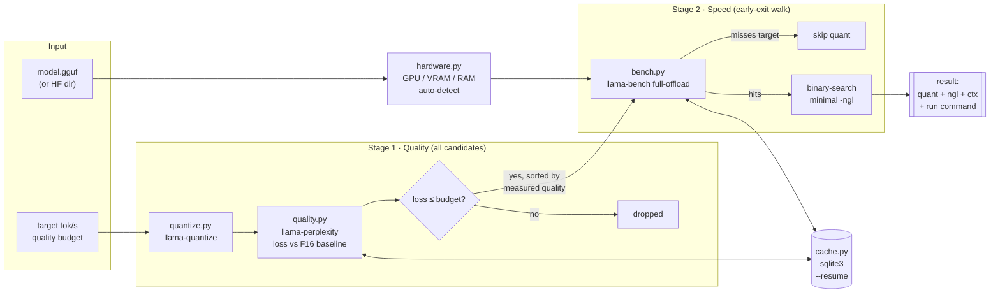

<div align="center">

**English** | [한국어](README.ko.md)

# 🎯 FiTuna

**Stop guessing your llama.cpp config. Measure it.**

*Hardware-benchmark-driven auto-tuning for local LLMs — give it a model, a
target speed, and a quality budget; get back the smallest config that
actually hits the numbers on **your** machine.*

[](https://github.com/leeyunseokarchive/fituna/actions/workflows/ci.yml)
[](LICENSE)
[](https://www.python.org/downloads/)
[](docs/SBOM.md)
[](CONTRIBUTING.md)

**심사위원 · 검증기관용 한국어 재현 가이드 → [REVIEWERS.md](REVIEWERS.md)** *(Korean reproduction guide for competition judges & verification agency)*

</div>

---

```bash
$ fituna run --model Qwen3-4B-Instruct-2507-F16.gguf \
    --target-tps 30 --max-quality-loss 5 --ctx 4096 --wikitext wiki.txt --out ./out

[Q6_K]   full-offload 28.48 tok/s < target 30.00, skipping (early-exit B)
[Q8_0]   full-offload 24.22 tok/s < target 30.00, skipping (early-exit B)
[Q5_K_M] full-offload 29.59 tok/s < target 30.00, skipping (early-exit B)
[Q4_K_M] found ngl=33 meeting target -- done

FiTuna result: MEETS TARGET
  quant : Q4_K_M   ngl : 33   ctx : 4096
  gen tok/s : 30.81      quality loss : 1.73%

  artifact: out/Qwen3-4B-Instruct-2507-...-Q4_K_M.gguf  (2.3 GB -- already produced during the search)

  1) local API server (OpenAI-compatible):
       llama-server -m out/Qwen3-...-Q4_K_M.gguf -ngl 33 -c 4096 --port 8080
  2) import into Ollama: re-run with --export-ollama to write a Modelfile beside the artifact
  3) terminal chat (interactive check):
       llama-cli -m out/Qwen3-...-Q4_K_M.gguf -ngl 33 -c 4096
```

That's a real run (Apple M3 Pro — [full logs](docs/RESULTS.md)). Note what
happened: the "obviously best" Q8_0 **failed** the speed target, Q5_K_M missed
it by **0.41 tok/s**, and the answer wasn't just a quant — it was a quant
*plus* the minimal GPU offload (`-ngl 33`, not full 36). None of that is
predictable from a spec sheet. That's why FiTuna measures.

## Why

Running a local LLM means picking a quantization level (Q2–Q8), a GPU offload
layer count (`-ngl`), and a context length — a search space that people
navigate today by trial and error:

- **Ollama / LM Studio** apply fixed per-model presets; a request for finer
  quantization control was [closed as not planned](https://github.com/ollama/ollama/issues/14674).
- **NVIDIA Model Optimizer**'s AutoQuantize is CUDA-only.
- **VRAM calculators & chatbot advice** estimate from specs — and specs
  don't know your thermals, memory bandwidth, or llama.cpp build flags.

FiTuna replaces the guesswork with a measured search. It orchestrates the
llama.cpp binaries you already have (`llama-quantize`, `llama-bench`,
`llama-perplexity`) and finds the config that meets your target — verified on
your hardware, reproducible from cache.

## Features

- 🔍 **Target-driven search** — input: model + target tok/s + max quality
  loss %. Output: quant × `-ngl` × ctx config + a ready-to-run command.
- 📏 **Measured, not assumed** — candidates are walked in *measured*
  perplexity order (in our runs Q6_K beat Q8_0 — [see data](docs/RESULTS.md)),
  with a binary search for the minimal GPU offload.
- ⚡ **Aggressive early exits** — quality-gate failures and hopeless quants
  are skipped without wasting benches; a bench that can't finish in time
  counts as "too slow", not a crash.
- 🗃️ **Reproducible cache** — results keyed by model fingerprint × hardware
  × llama.cpp build version in sqlite3; `--resume` re-answers in <1s and
  survives interruptions.
- 🖥️ **Hardware auto-detection** — NVIDIA (`nvidia-smi`), AMD (`rocm-smi`),
  Apple Silicon unified memory (`system_profiler`), with manual override.
- 🪶 **Zero runtime dependencies** — pure Python 3.11+ stdlib. `pip install`
  and go.

## Quickstart

**1. Get llama.cpp** (provides the actual quantize/bench/perplexity engines):

```bash
brew install llama.cpp        # macOS/Linux Homebrew — ships all needed binaries
# or build from source (any platform):
git clone https://github.com/ggml-org/llama.cpp
cmake -S llama.cpp -B llama.cpp/build && cmake --build llama.cpp/build --config Release
```

**2. Install FiTuna** (into a virtualenv built with Python 3.11+ —
macOS's system `python3` is 3.9):

```bash
git clone https://github.com/leeyunseokarchive/fituna
python3.13 -m venv .venv && source .venv/bin/activate
pip install -e fituna
```

**3. Let the wizard do the rest:**

```bash
fituna quickstart
```

Six steps — environment check, targets, license requirements, model
(local scan / verified shortlist with download / HuggingFace search / your
own path), quality corpus, then the search itself. It prints the fully
assembled `fituna run ...` command **before** executing it, so the next run
is a one-liner you already have. Needs a terminal; in CI or a pipe use
`fituna run` directly — every search parameter the wizard assembles maps to
a public `run` flag (proven by an argv-equality test). Model download (the
curated shortlist) and the HuggingFace search are wizard-only conveniences
with no `run` equivalent — `run --model` still expects a `.gguf` already on
disk.

It never predicts throughput: memory fit is arithmetic (published file size
vs detected VRAM/RAM, with the assumed margin stated), speed is measured
rather than guessed, every candidate shows its license, and
[`docs/RESULTS.md`](docs/RESULTS.md) numbers appear only as records of what
was measured on named hardware.

### The script path (what the wizard assembles for you)

**A. Get a quality corpus.** Quality loss is measured as perplexity increase
on a plain-text corpus — and it's only meaningful on text resembling your
actual workload. Any UTF-8 text file works (`--quality-corpus`).

```bash
fituna fetch-corpus --lang en --out wikitext-2-raw-test.txt        # wikitext-2 test split
fituna fetch-corpus --lang ko --out kowiki-corpus.txt --rows 500   # Korean Wikipedia
```

Pulls rows straight from HuggingFace's public dataset-viewer REST API via
stdlib `urllib` — no `pip install datasets` (which drags in pyarrow/pandas)
needed. Korean models should use the Korean corpus so the quality gate
measures what actually degrades for Korean users — the same quant can
measure 2–3× different loss on the two corpora, and in Run 3 that was enough
to change the verdict the tool returned. (The gap that did it, 0.96 pp, sits
inside the error bar a 32-chunk estimate carries — so the corpus you gate on
decides the answer here, but we do not claim the underlying quality
difference is resolved; see the
[qualification on Run 3](docs/RESULTS.md#run-3--english-vs-korean-quality-corpus-same-model-same-quants).)
Measure the language you'll run. Both presets are
CC BY-SA 3.0; `fetch-corpus` prints the
attribution/share-alike notice and source URL to stdout when it finishes.
Have your own dataset in mind? `--dataset/--config/--split` override the
preset (`fituna fetch-corpus --help`).

**B. Run:**

```bash
fituna doctor                             # confirm the environment is ready
fituna detect-hw                          # see what FiTuna detects
fituna run --model your-model-F16.gguf \
  --target-tps 30 --max-quality-loss 5 \
  --ctx 4096 --wikitext wikitext-2-raw-test.txt --out ./out --resume
```

Pass an F16/BF16 `.gguf` directly (many models publish one), or an HF-format
directory if `convert_hf_to_gguf.py` is available (source checkout +
`pip install torch transformers`; package-manager builds don't ship it).

> **Disk usage:** the search quantizes every candidate that reaches the
> quality stage — ~12 GB for four candidates of a 4B model. Files are reused
> across runs; narrow `--quant` to bound this.

## How it works


```mermaid
flowchart LR
    subgraph Input
        A["model.gguf<br/>(or HF dir)"]
        B["target tok/s<br/>quality budget"]
    end

    A --> C[hardware.py<br/>GPU / VRAM / RAM<br/>auto-detect]
    B --> D

    subgraph "Stage 1 · Quality (all candidates)"
        D[quantize.py<br/>llama-quantize] --> E[quality.py<br/>llama-perplexity<br/>loss vs F16 baseline]
        E --> F{"loss ≤ budget?"}
        F -- no --> X[dropped]
    end

    subgraph "Stage 2 · Speed (early-exit walk)"
        F -- yes, sorted by<br/>measured quality --> G[bench.py<br/>llama-bench full-offload]
        G -- misses target --> Y[skip quant]
        G -- hits --> H["binary-search<br/>minimal -ngl"]
    end

    C --> G
    H --> I[["result:<br/>quant + ngl + ctx<br/>+ run command"]]
    E & G <--> K[(cache.py<br/>sqlite3<br/>--resume)]
```

**Stage 1** measures perplexity loss for *every* candidate — because Stage 2
walks them in **measured** quality order, and you can't sort by a number you
haven't measured. (In practice the conventional Q8_0-first ranking was wrong
on both models we tested.) **Stage 2** early-exits hard: a quant whose
full-offload bench misses the target is dropped without further benches, and
the first quant that passes wins — lower-quality quants are never benchmarked.

All subprocess results land in a sqlite3 cache keyed by model fingerprint,
hardware profile, **and llama.cpp build version** — so `--resume` never
serves numbers measured under a different backend build.

Design details: [docs/ARCHITECTURE.md](docs/ARCHITECTURE.md) · Interface
contract: [`fituna/config.py`](fituna/config.py)

## Measured results

| Model | Target | What the "obvious" pick did | What FiTuna found |
|---|---|---|---|
| Qwen3-4B-Instruct (Apache 2.0) | 30 tok/s, ≤5% loss | Q8_0: 24.22 tok/s ❌ (and measured *worse* quality than Q6_K) | **Q4_K_M @ ngl=33 → 30.81 tok/s, 1.73% loss** ✅ |
| SmolLM2-135M (Apache 2.0) | 240 tok/s, ≤5% loss | Q8_0: 205.91 tok/s ❌ | **Q6_K → 249.50 tok/s, 0.53% loss** ✅ (and Q4_K_M measured *slower* than Q6_K) |
| Midm-2.0-Mini-Instruct, Korean (MIT) | 40 tok/s, ≤5% loss | Q8_0: 34.26 tok/s ❌ | **Q4_K_M @ ngl=48 → 44.62 tok/s, 2.58% loss** ✅ (the two corpora report different Q6_K/Q5_K_M mid-table orders, but reading the per-chunk trace — 125 nested, autocorrelated points, not independent trials — the English order never changes sign while the Korean one changes sign nine times after n=16 (ten times counting from n=4) — so a corpus-driven reorder is [not something we could establish](docs/RESULTS.md#how-big-is-a-perplexity-gap-the-error-bar-we-had-been-discarding)) |

Environment: Apple M3 Pro, llama.cpp build 9960. Full logs, timings,
run-to-run variance analysis (including a thermal-throttle outlier we caught
and documented): **[docs/RESULTS.md](docs/RESULTS.md)** · Usage scenarios:
[docs/USE_CASES.md](docs/USE_CASES.md)

Reproduce on NVIDIA/Linux yourself — one-click Colab notebook (free T4
tier): [notebooks/colab_nvidia_verification.ipynb](notebooks/colab_nvidia_verification.ipynb)
[](https://colab.research.google.com/github/leeyunseokarchive/fituna/blob/main/notebooks/colab_nvidia_verification.ipynb)

## MCP server — measured answers for AI agents

Ask a chatbot "which local model config fits my machine?" and it guesses
from specs. Point it at FiTuna's MCP server and it *measures*:

```bash
claude mcp add fituna -- fituna-mcp      # or any MCP client, stdio transport
```

Tools exposed:

| Tool | What it does |
|---|---|
| `fituna_detect_hardware` | GPU vendor/name, VRAM, CPU cores, RAM as FiTuna sees them |
| `fituna_recommend` | Run the measured search for a target spec; returns the winning config, measured tok/s, measured quality loss, and a ready-to-run command. Slow once, ~1 s on repeat (cache). |

The server is stdlib-only like the rest of FiTuna — the MCP stdio transport
is newline-delimited JSON-RPC 2.0, no SDK required
([`fituna/mcp_server.py`](fituna/mcp_server.py)).

## Project structure

```
fituna/
├── cli.py         # argparse entry point, exit-code mapping (0/1/2/3)
├── quickstart.py  # interactive wizard (fituna quickstart) over run's own flags
├── config.py      # frozen-dataclass interface contract (single source of truth)
├── hardware.py    # GPU/VRAM/CPU/RAM auto-detection + manual override
├── binaries.py    # llama.cpp binary discovery + capability introspection
├── doctor.py      # environment self-diagnosis (fituna doctor subcommand)
├── corpus.py      # quality-corpus download (fituna fetch-corpus, stdlib urllib)
├── errors.py      # re-export shim for the FiTunaError hierarchy (defined in config.py)
├── mcp_server.py  # MCP stdio server (JSON-RPC 2.0, fituna-mcp entry point)
├── model_info.py  # direct GGUF header parsing (struct), HF-dir conversion
├── quantize.py    # llama-quantize wrapper (idempotent, atomic writes)
├── quality.py     # llama-perplexity wrapper (quality-loss measurement)
├── bench.py       # llama-bench wrapper (throughput measurement)
├── search.py      # the two-stage search orchestrator
├── cache.py       # sqlite3 result cache (--resume)
└── report.py      # human/JSON result rendering + run-command builder
```

241 unit tests (mocked subprocess/network layer) + per-module runnable
self-checks + 3-OS × 2-Python CI matrix. Real-binary E2E validated on macOS (Apple
Silicon/Metal) and Linux (NVIDIA T4/CUDA); see
[Known limitations](#known-limitations).

## Roadmap

- [x] **MCP server** — AI coding agents get measured local-model
  recommendations instead of guessing from specs (`fituna-mcp`)
- [x] **Korean calibration corpus option** — `--quality-corpus` gates on
  any language's text; measured EN-vs-KO comparison shows the corpus alone
  can flip a feasibility verdict (the tool genuinely produced different
  verdicts from the same two commands — though the underlying quality gap
  driving it sits inside the estimator's own resolution, so read it as
  "the corpus you gate on decides the verdict", not proof one language
  degrades less)
  ([data](docs/RESULTS.md#run-3--english-vs-korean-quality-corpus-same-model-same-quants))
- [x] NVIDIA/Linux measured run (Tesla T4 via the Colab notebook —
  [Run 4](docs/RESULTS.md#run-4--nvidia-tesla-t4-linux-google-colab):
  the quality-gate verdict itself flipped between Metal and CUDA)
- [ ] Surface llama-bench std-dev ([#9](https://github.com/leeyunseokarchive/fituna/issues/9))
  *and* llama-perplexity's `+/-` standard error
  ([#8](https://github.com/leeyunseokarchive/fituna/issues/8)) to auto-flag
  marginal verdicts — `quality.py` currently parses the PPL and discards the
  error bar, which is how Run 5 came to publish a claim it later had to
  withdraw
- [ ] Multi-GPU `--tensor-split` support
  ([#11](https://github.com/leeyunseokarchive/fituna/issues/11) — help wanted:
  we have no multi-GPU machine to measure on)
- [ ] Real-hardware validation on Windows
  ([#12](https://github.com/leeyunseokarchive/fituna/issues/12) — CI runs
  there, but nothing has been run against real llama.cpp binaries)

Everything above is tracked in the
[v0.2.0 milestone](https://github.com/leeyunseokarchive/fituna/milestone/1),
along with the smaller items — pytest coverage for the llama.cpp output
parsers ([#10](https://github.com/leeyunseokarchive/fituna/issues/10), good
first issue) and documenting how `--ppl-chunks` moves the quality figure
([#13](https://github.com/leeyunseokarchive/fituna/issues/13)).

## Scope

FiTuna recommends; it doesn't execute or serve. The output is the quantized
`.gguf` plus `llama-server` / `llama-cli` commands you copy and run (and,
with `--export-ollama`, an Ollama `Modelfile` written next to it) — FiTuna
never launches any of them, and it runs no inference server of its own.

That's a boundary, not an oversight. Actually serving inference is
llama.cpp's job (and Ollama's, and LM Studio's), and duplicating it would
compete with the exact tools this README contrasts itself against, for no
differentiated value — FiTuna's only claim is that the *search* is measured,
not guessed. A server process also sits awkwardly next to a
zero-runtime-dependency design.

The Ollama half of that is now shipped (`--export-ollama` writes the
measured `num_gpu`/`num_ctx` into a Modelfile — both tools apply a fixed
per-model preset otherwise, [the exact gap cited above](https://github.com/ollama/ollama/issues/14674)).
Two extensions that stay inside this boundary rather than crossing it are
still tracked in [#19](https://github.com/leeyunseokarchive/fituna/issues/19):
running the winning command directly (`--launch`), and an LM Studio preset
export. The
MCP server already covers the agent-facing version of "what happens after
the recommendation": an agent reads `fituna_recommend`'s answer and decides
what to do with it, no human copying a command required.

## Known limitations

- **Single GPU only** — first GPU reported by `nvidia-smi`/`rocm-smi`;
  no `--tensor-split`.
- **Windows AMD auto-detection** — `rocm-smi` has no mainstream Windows
  distribution; use `--gpu amd --vram-mb <N>`.
- **Quality = perplexity on a corpus you choose** — a proxy, not a
  guarantee of domain quality. Gate on text resembling your workload
  (`--quality-corpus`; measured EN-vs-KO comparison — real verdict flip,
  underlying gap inside the estimator's resolution — in
  [docs/RESULTS.md](docs/RESULTS.md)).
- **The quality verdict depends on `--ppl-chunks`** — perplexity loss is an
  estimate over `chunks × 512` tokens, and its absolute value grows with the
  chunk count (measured: the same Korean Q4_K_M reads 2.58 % at 32 chunks and
  4.08 % at 128, shrinking the margin against a 5 % gate from 2.42 pp to
  0.92 pp). A candidate close to your budget should be re-measured with more
  chunks before the PASS is trusted; see
  [docs/RESULTS.md](docs/RESULTS.md).
- **Benchmarks are thermally sensitive** — verdicts within a few tok/s of
  the target are marginal; see the
  [variance analysis](docs/RESULTS.md#run-to-run-variance-measured-not-hidden).
- Real-hardware E2E: macOS (Apple Silicon/Metal) and Linux (NVIDIA
  T4/CUDA, via the Colab notebook). Windows paths are unit-tested + CI-run
  but not yet integration-run against real binaries.

## Contributing

Contributions welcome — the codebase is small, dependency-free, and
contract-first (start at [`fituna/config.py`](fituna/config.py)). See
[CONTRIBUTING.md](CONTRIBUTING.md), the development methodology in
[docs/DEVELOPMENT.md](docs/DEVELOPMENT.md), release history in
[CHANGELOG.md](CHANGELOG.md), and vulnerability reporting in
[SECURITY.md](SECURITY.md).

## License

[MIT](LICENSE) © FiTuna contributors. Third-party notices (llama.cpp and
subprocess-invoked tools): [THIRD_PARTY_NOTICES.md](THIRD_PARTY_NOTICES.md) ·
SBOM: [docs/SBOM.md](docs/SBOM.md) · AI-assisted development disclosure:
[docs/AI_MODEL_USAGE.md](docs/AI_MODEL_USAGE.md)
