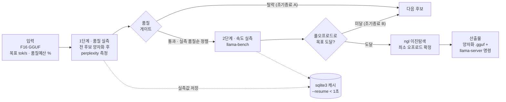

<div align="center">

**한국어** | [English](README.en.md)


# FiTuna

**llama.cpp 설정, 추측하지 말고 측정하세요.**

모델 파일과 목표 속도(tok/s), 허용 품질손실(%)을 입력하면, 내 기기에서
실제로 그 수치를 달성하는 가장 가벼운 llama.cpp 설정(양자화 레벨,
GPU 오프로드, 컨텍스트 길이의 조합)을 실측 벤치마크로 찾아 줍니다.

**`pip install fituna`**

[](https://github.com/leeyunseokarchive/fituna/actions/workflows/ci.yml)
[](https://pypi.org/project/fituna/)
[](LICENSE)
[](https://www.python.org/downloads/)
[](docs/SBOM.md)
[](CONTRIBUTING.md)

**[▶ 시연영상](https://youtu.be/ejNnWFm9V6I) · [심사위원·검증기관용 재현 가이드](REVIEWERS.md)**


</div>

## 개발·검증 문서

| 문서 | 내용 |
|---|---|
| [아키텍처](docs/ARCHITECTURE.md) | 모듈 구조, 실행 흐름, 탐색 알고리즘과 오류 처리 |
| [개발 및 검증 방법](docs/DEVELOPMENT.md) | 설계 원칙, 테스트·CI, 리뷰와 실제 하드웨어 검증 절차 |
| [기여 안내](CONTRIBUTING.md) | 개발 환경 구성, 검사 실행과 변경 제출 방법 |
| [실측 결과](docs/RESULTS.md) | 모델·하드웨어별 전체 실행 결과와 변동성 분석 |
| [오픈소스 활용](docs/OPEN_SOURCE_USAGE.md) | 활용한 오픈소스와 결합 방식, 라이선스 의무 |
| [라이선스 검증](docs/LICENSE_COMPLIANCE.md) | 배포물 구성, 의존성·SPDX 검사와 재현 명령 |
| [심사·재현 가이드](REVIEWERS.md) | 심사위원이 핵심 결과를 직접 확인하는 순서 |

## 왜 FiTuna 인가?

llama.cpp로 로컬 LLM을 돌리려면 세 가지를 골라야 합니다.
- 모델을 어느 정도로 압축할지 (양자화 레벨(Q2–Q8))
- 모델 레이어를 몇 개까지 GPU에서 실행할지 (-ngl)
- 한 번에 얼마나 긴 대화 맥락을 유지할지 (컨텍스트 길이)

양자화 레벨이 낮으면 속도와 메모리 사용량에는 유리하지만, 모델 품질은 떨어질 수 있습니다. GPU에 올리는 레이어 수와 컨텍스트 길이 역시 속도와 메모리 사용량에 영향을 줍니다.

문제는 이 설정들의 조합이 수십 가지에 이른다는 점입니다. 지금은 대부분의 사용자가 여러 설정을 직접 실행해 보면서, 자신의 하드웨어에 맞는 구성을 **추측에 의존하며 감으로 찾고 있습니다.**

하지만 개발자들이 실제로 알고 싶은 건 단 세 가지입니다.

- 내 기기에서 원하는 속도를 낼 수 있는가? (목표 속도)
- 속도를 높였을 때 품질은 얼마나 떨어지는가? (품질 손실)
- 목표 속도와 품질을 만족하면서 가장 가벼운 구성은 무엇인가? (최소 구성)

그동안 이 세 가지 질문에 명확히 답해 주는 도구는 없었습니다.

| 비교 대상 | ① 목표 속도 | ② 품질 손실 | ③ 최소 구성 |
|---|---|---|---|
| VRAM 계산기 | 모델이 VRAM에 들어가는지만 계산 | 다루지 않음 | 다루지 않음 |
| 챗봇 조언 | 설정 제안 가능, 반복 실측 보장 없음 | 일반적 경향 설명 | 최소 통과 구성 보장 없음 |
| NVIDIA AutoQuantize | 목표 속도 입력 불가 | 다룸 — 단 CUDA 전용 | CUDA 전용 |
| **FiTuna** | **실측 tok/s로 달성 여부 확인** | **실측 perplexity로 수치화** | **이진탐색으로 자동 산출** |

실제 측정 결과, **직관적으로 가장 좋아 보였던 Q8_0**은 목표 속도를 충족하지
못했습니다. 반면 **Q4_K_M에 최소 GPU 오프로드인 `-ngl 33`**을 적용한 조합은
속도와 품질 목표를 모두 충족했습니다.

이처럼 같은 모델이라도 최적 구성은 하드웨어와 목표 속도에 따라 달라지며,
이를 추측만으로 안정적으로 고르기는 어렵습니다.

FiTuna는 수십 가지 조합을 감으로 반복 실행하는 대신, 내 기기에서 직접 측정해
속도와 품질을 검증하고 조건을 만족하는 가장 가벼운 구성을 찾아줍니다.

 **추측이 아니라 실측으로 내 하드웨어의 최적점을 찾는 것. 그것이 FiTuna를 써야 하는 이유입니다.**

## 1분 데모 체험

정말 되는지 직접 확인하는 가장 빠른 길입니다. 258 MB짜리 작은 모델로
전체 파이프라인(다운로드 → 양자화 → 품질 게이트 → 벤치마크)이 1분
남짓에 끝납니다. 실행 화면은 [시연영상](https://youtu.be/ejNnWFm9V6I)에서
먼저 확인할 수 있습니다:

```bash
brew install llama.cpp python@3.13
python3.13 -m venv .venv
source .venv/bin/activate
pip install fituna
fituna fetch-corpus --lang en --out wiki.txt
fituna run --hf bartowski/SmolLM2-135M-Instruct-GGUF \
  --target-tps 240 \
  --max-quality-loss 5 \
  --ctx 2048 \
  --quality-corpus wiki.txt \
  --out ./out --resume
```

`fituna run`의 각 플래그가 뜻하는 것:

| 플래그 | 의미 | |
|---|---|---|
| `--hf bartowski/SmolLM2-…` | 사용할 모델 — HuggingFace 저장소명. F16 GGUF를 자동 다운로드 | 필수¹ |
| `--target-tps 240` | 목표 생성 속도 (tok/s) | 필수 |
| `--max-quality-loss 5` | 허용 품질손실 상한 (%) — 이 이상 나빠지는 후보는 탈락 | 필수 |
| `--ctx 2048` | 컨텍스트 길이 (한 번에 유지할 대화 맥락 크기) | 선택 (기본 4096) |
| `--quality-corpus wiki.txt` | 품질 측정용 텍스트 — 바로 위에서 받은 파일 | 필수 |
| `--out ./out` | 산출물·캐시 저장 폴더 | 선택 (기본 `./out`) |
| `--resume` | 측정값을 캐시에 저장·재사용 — 첫 실행부터 붙이는 것을 권장 | 선택 |

¹ 이미 받아 둔 모델 파일이 있다면 `--hf` 대신 `--model <경로.gguf>`.

### 예시 결과

위 명령이 끝나면 이런 결과가 출력됩니다 (Apple M3 Pro 실행 예):

```
FiTuna result: MEETS TARGET

  quant           : Q8_0        # <- 찾아낸 최적 양자화 레벨
  ngl             : 26          # <- 목표를 만족하는 최소 GPU 오프로드 층수
  ctx             : 2048        # <- 검증된 컨텍스트 길이

  prompt tok/s (pp): 2017.64
  gen tok/s    (tg): 261.78     # <- 실측 생성 속도 -- 목표 240을 통과

  perplexity      : 18.2931 (baseline 18.2407)
  quality loss    : 0.29%       # <- 실측 품질손실 -- 허용치 5% 이내

  artifact: out/SmolLM2-135M-Instruct-8078a5b74b5a-Q8_0.gguf  (144.8 MB -- already produced during the search)

  1) local API server (OpenAI-compatible):
       /opt/homebrew/bin/llama-server -m out/SmolLM2-135M-Instruct-8078a5b74b5a-Q8_0.gguf -ngl 26 -c 2048 --port 8080
  2) import into Ollama: re-run with --export-ollama to write a Modelfile beside the artifact
  3) terminal chat (interactive check):
       /opt/homebrew/bin/llama-cli -m out/SmolLM2-135M-Instruct-8078a5b74b5a-Q8_0.gguf -ngl 26 -c 2048
```

읽는 법: 첫 줄이 판정입니다 — `MEETS TARGET`은 목표를 만족하는 구성을
찾았다는 뜻이고, 이어서 그 구성(quant × ngl × ctx)과 실측 근거(속도·품질손실)가
나옵니다. `artifact:`의 양자화 모델 파일은 탐색 중에 이미 생성됩니다.
`--resume`을 붙인 같은 명령은 저장된 측정값을 재사용합니다. 절대 수치와
승자 quant는 기기·실행 시점에 따라 달라질 수 있습니다 —
[재실행 변동성 실측](docs/RESULTS.md#run-to-run-variance-measured-not-hidden).

## 실측 결과

크기가 다른 세 모델에 각각 목표를 걸고 탐색한 결과입니다. Q8_0은 원본에
가장 가까운 손실이라 보편적으로 많이 채택되는 양자화 수준인데, 세 번 모두
이 기본값이 속도 목표에서 탈락했습니다:

| 모델 | 목표 | 보편적인 양자화 수준(Q8_0) 실측값 | FiTuna가 찾은 답(결과 속도, 손실률) |
|---|---|---|---|
| Qwen3-4B-Instruct | 30 tok/s, ≤5% 손실 | Q8_0: 24.22 tok/s ❌ (품질도 Q6_K보다 나쁘게 측정) | **Q4_K_M @ ngl=33 → 30.81 tok/s, 1.73%** ✅ |
| SmolLM2-135M | 240 tok/s, ≤5% 손실 | Q8_0: 205.91 tok/s ❌ | **Q6_K → 249.50 tok/s, 0.53%** ✅ (더 작은 Q4_K_M이 더 느린 역전 실측) |
| Midm-2.0-Mini (한국어) | 40 tok/s, ≤5% 손실 | Q8_0: 34.26 tok/s ❌ | **Q4_K_M @ ngl=48 → 44.62 tok/s, 2.58%** ✅ |

Apple M3 Pro, llama.cpp build 9960. 전체 로그·재실행 변동성 분석:
[docs/RESULTS.md](docs/RESULTS.md) · 사용 시나리오:
[docs/USE_CASES.md](docs/USE_CASES.md) · NVIDIA/Linux 재현(무료 T4):
[](https://colab.research.google.com/github/leeyunseokarchive/fituna/blob/main/notebooks/colab_nvidia_verification.ipynb)

## Q: 그냥 챗봇에게 물어보면 되지 않나요?

결과보고서와 같은 조건으로 비교했습니다. Qwen3-4B에 목표 생성 속도
30 tok/s, 품질 손실 5% 이하를 제시하고 FiTuna와 세 챗봇이 제시한 설정을
Apple M3 Pro에서 각각 3회 독립 실행했습니다.

| 산출 방식 | 제시한 설정 | 실측 생성 속도¹ | 품질 손실 | 30 tok/s 통과 |
|---|---|---:|---:|---:|
| **FiTuna** | **Q4_K_M, `ngl=33`** | **32.68 ± 1.71 tok/s** | **1.75%** | **3/3회** |
| Claude Opus 5 | Q5_K_M, `ngl=36` | 30.49 ± 0.88 tok/s | 1.53% | 2/3회 |
| ChatGPT 5.6 Sol | Q4_K_M, `ngl=28` | 28.92 ± 1.37 tok/s | 1.75% | 1/3회 |
| Gemini 3.1 Pro | 설정 미제시(질의 수행 미지원) | — | — | 판정 불가 |

¹ 독립 실행 3회 평균 ± 실행 간 표준편차이며 각 실행은 내부 측정 5회를
포함합니다. 품질은 WikiText-2 32청크에서 F16 대비 perplexity 증가율로
측정했습니다.


설정을 제시한 세 방식 모두 품질 목표는 통과했습니다. 그러나 FiTuna만 속도
목표를 3회 모두 만족했고, Claude 제안보다 GPU 오프로드도 3개 층 적었습니다.
ChatGPT 제안은 오프로드가 가장 작았지만 3회 중 1회만 통과했습니다. 이 결과는
챗봇의 일반 성능 순위가 아니라, **특정 하드웨어의 최소 통과 설정은 반복 실측이
필요하다**는 점을 보여줍니다. 실험 조건·개별 실행값·해석 한계:
[docs/CHATBOT_COMPARISON.md](docs/CHATBOT_COMPARISON.md)

## 동작 원리


```mermaid
flowchart LR
    A["입력<br/>F16 GGUF<br/>목표 tok/s · 품질예산 %"] --> B["1단계 · 품질 실측<br/>전 후보 양자화 후<br/>perplexity 측정"]
    B --> C{"품질<br/>게이트"}
    C -->|"탈락 (조기종료 A)"| X["다음 후보"]
    C -->|"통과 · 실측 품질순 정렬"| D["2단계 · 속도 실측<br/>llama-bench"]
    D --> E{"풀오프로드로<br/>목표 도달?"}
    E -->|"미달 (조기종료 B)"| X
    E -->|도달| F["ngl 이진탐색<br/>최소 오프로드 확정"]
    F --> G["산출물<br/>양자화 .gguf +<br/>llama-server 명령"]
    B -.실측값 저장.-> H[("sqlite3 캐시<br/>--resume < 1초")]
    D -.-> H
```

FiTuna는 두 단계로 작동합니다.

1. **품질 손실 측정** : **모든** 후보를 양자화해 품질
손실을 먼저 측정합니다. 측정하지 않은 숫자로는 후보를 줄 세울 수 없기
때문입니다.

2. **속도 측정** : 품질 손실 측정 단계에서의 순서대로 속도를 재고, 목표를 놓친
후보는 추가 벤치마크 없이 바로 버립니다. 모든 측정값은 sqlite3에
캐시되며, 캐시 키에 llama.cpp 빌드 버전까지 들어가므로 엔진을 업그레이드한
뒤 예전 수치를 잘못 재사용하는 일이 없습니다.

자세한 동작 원리는 아래 문서에서 확인 가능합니다:
[docs/ARCHITECTURE.md](docs/ARCHITECTURE.md)

## 설치

```bash
python3.13 -m venv .venv
source .venv/bin/activate
pip install fituna
```

Python 3.11+가 필요합니다. 이미 설치된 3.11+ 인터프리터가 있다면 첫 줄을
그 버전으로 바꿔도 됩니다(예: `python3.12`). macOS 기본 `python3`(3.9.6)로는
동작하지 않으며, 3.11+가 하나도 없다면 `brew install python@3.13`으로
받으세요. 런타임 의존성은 없습니다. 엔진인 llama.cpp도 필요합니다:

```bash
brew install llama.cpp        # macOS/Linux Homebrew
```

<details>
<summary><b>소스 빌드 · 개발 설치</b></summary>

```bash
# llama.cpp 소스 빌드 (모든 플랫폼, NVIDIA는 -DGGML_CUDA=ON 추가)
git clone https://github.com/ggml-org/llama.cpp
cmake -S llama.cpp -B llama.cpp/build && cmake --build llama.cpp/build --config Release
# 이후 fituna 명령에 --llama-bin-dir llama.cpp/build/bin 추가

# FiTuna 개발 설치
git clone https://github.com/leeyunseokarchive/fituna
python3.13 -m venv .venv && source .venv/bin/activate
pip install -e fituna
```

</details>

## 명령어

처음이라면 `fituna quickstart`가 가장 쉽습니다 — 아래 명령들을 몰라도
마법사가 환경 점검부터 탐색 실행까지 순서대로 안내합니다. 각 명령의 전체
옵션은 `fituna <명령> -h`로 볼 수 있습니다.

| 명령 | 역할 |
|---|---|
| `fituna quickstart` | 6단계 대화형 마법사 — 환경 점검부터 탐색 실행까지. 조립한 `fituna run` 명령을 실행 전에 보여줌 |
| `fituna run` | 탐색 본체. `--model <F16.gguf>` 또는 `--hf repo[:file]`(HF에서 자동 다운로드), `--json` 지원 |
| `fituna doctor` | 환경 9개 항목 점검. 실패마다 해결 명령 제시 |
| `fituna fetch-corpus` | 품질 측정용 코퍼스 다운로드 (`--lang en/ko`, 표준 라이브러리만 사용) |
| `fituna detect-hw` | GPU·VRAM·CPU·RAM 자동 감지 결과 확인 |
| `fituna-mcp` | AI 에이전트용 MCP 서버 (아래 참고) |

<details>
<summary><b>품질 측정 코퍼스 고르기</b> — 같은 quant도 언어에 따라 2~3배 다른 손실</summary>

품질손실은 텍스트 코퍼스에 대한 perplexity 증가율이므로, 실제 사용할
텍스트와 비슷할 때만 의미가 있습니다. UTF-8 파일이면 무엇이든 됩니다
(`--quality-corpus`):

```bash
fituna fetch-corpus --lang en --out wikitext-2-raw-test.txt        # wikitext-2
fituna fetch-corpus --lang ko --out kowiki-corpus.txt --rows 500   # 한국어 위키백과
```

Run 3에서는 코퍼스만 바꿔도 도구의 판정이 바뀌었습니다
([실측과 단서 조항](docs/RESULTS.md#run-3--english-vs-korean-quality-corpus-same-model-same-quants)).
두 프리셋 모두 CC BY-SA 3.0이며 다운로드 완료 시 라이선스 고지를 출력합니다.

</details>

<details>
<summary><b>디스크 사용량 · 캐시</b></summary>

탐색은 품질 단계에 도달한 모든 후보를 양자화합니다 — 4B 모델의 후보 4개
기준 약 12 GB. 파일은 재실행 시 재사용되고 `--quant`로 후보를 좁혀 용량을
제한할 수 있습니다. 결과는 모델 지문 × 하드웨어 × llama.cpp 빌드 버전을
키로 sqlite3에 캐시되며, `--resume`은 1초 미만으로 재응답합니다.

</details>

<details>
<summary><b>라이브러리로 사용</b></summary>

런타임 의존성이 없어 모듈을 바로 임포트할 수 있습니다:

```python
from fituna.hardware import detect_hardware

hw = detect_hardware()
print(f"{hw.gpu_vendor.value}: {hw.gpu_name}, {hw.vram_mb} MB VRAM")
# apple: Apple M3 Pro, 18432 MB VRAM
```

탐색 자체는 `fituna.search.search()`를 호출하면 됩니다 — 필요한
`ModelInfo`·`BinaryPaths`·코퍼스 경로는 `fituna run`이 조립해 주는 것과
같습니다 ([search.py](fituna/search.py), [config.py](fituna/config.py)).

</details>

## MCP 서버

기존에 챗봇에게 "내 컴퓨터에서 잘 돌아가는 로컬 모델은 무엇인가?"라고 물으면
공개 사양과 벤치마크를 바탕으로 설정을 제안할 수 있지만, 이 기기의 목표 달성
여부를 확정할 수는 없습니다. FiTuna MCP 서버를 연결하면 AI 에이전트가 로컬
실측 결과를 바탕으로 답할 수 있습니다:

```bash
claude mcp add fituna -- fituna-mcp      # stdio를 지원하는 모든 MCP 클라이언트
```

| 도구 | 반환 |
|---|---|
| `fituna_detect_hardware` | GPU 벤더·이름, VRAM, CPU 코어, RAM |
| `fituna_recommend` | 실측 탐색 결과 — 승자 설정, 실측 tok/s·품질손실, 실행 명령. 재요청 ~1초(캐시) |

외부 SDK 없이 표준 라이브러리로 구현한 JSON-RPC 2.0/stdio입니다
([mcp_server.py](fituna/mcp_server.py)).

## 범위와 한계

FiTuna는 **추천까지만** 합니다. 산출물은 탐색 중에 이미 만들어진 양자화
`.gguf` 파일과 복사해 쓰는 `llama-server`/`llama-cli` 명령이고
(`--export-ollama`를 주면 Ollama Modelfile도 함께), 모델을 실제로 띄우는
일은 llama.cpp에 맡깁니다([설계 근거](docs/ARCHITECTURE.md#why-this-shape)).
현재의 한계는 다음과 같습니다:

- **결과는 실행한 기기에서만 유효** — 사양표로 다른 기기의 결과를 추정하지 않습니다. 다른 기기에 적용할 설정이 필요하면 그 기기에서 FiTuna를 실행하세요(크로스플랫폼 CLI라 그대로 동작합니다). 기기마다 답이 다르다는 것이 실측이 필요한 이유입니다 — [같은 모델, M3 Pro와 T4의 상반된 결과](docs/RESULTS.md#run-4--nvidia-tesla-t4-linux-google-colab)
- **단일 GPU만 지원** — `--tensor-split` 없음
- **Windows AMD 자동 감지 불가** — `--gpu amd --vram-mb <N>`으로 수동 지정
- **품질 = 선택한 코퍼스의 perplexity** — 대리 지표. 실제 작업과 비슷한 텍스트로 측정할 것
- **판정은 `--ppl-chunks`에 의존** — 예산에 가까운 후보는 재측정 후 신뢰 ([측정된 영향](docs/RESULTS.md#how-big-is-a-perplexity-gap-the-error-bar-we-had-been-discarding))
- **벤치마크는 발열에 민감** — 목표와 몇 tok/s 차이의 판정은 경계선 ([변동성 분석](docs/RESULTS.md#run-to-run-variance-measured-not-hidden))
- **실기 E2E는 macOS·Linux** — Windows는 단위테스트·CI까지

## 협업 및 관리체계

FiTuna는 `main`을 항상 실행 가능한 기준선으로 두는 **GitHub Flow 기반**으로
운영합니다. 기능·버그·측정 결과를 바꾸는 작업은 다음 기록을 남깁니다.

**이슈·마일스톤 → 토픽 브랜치(`feat/…`, `fix/…`, `docs/…`, `chore/…`) →
Pull Request → CI·서면 리뷰 → `main` 병합**

- **계획 관리** — 버그와 기능 제안을 이슈 템플릿과 라벨로 구분하고,
  릴리스별 변경 사항은 [CHANGELOG.md](CHANGELOG.md)에 기록합니다.
- **품질 게이트** — 보호된 `main` 브랜치에 3개 OS × Python 2개 버전의
  CI 6개 작업을 필수 검사로 연결했습니다. 전체 단위 테스트와 17개 모듈
  자체 점검을 실행하고, llama.cpp 경계를 건드린 변경은 실제 하드웨어에서
  별도로 검증합니다.
- **리뷰와 추적성** — 현재 단일 메인테이너 프로젝트이므로 독립 승인 절차는
  없습니다. 대신 PR에 검사 범위·판단 근거·후속 수정 사항을 서면 자체 리뷰로
  남기고, 큰 후속 작업은 이슈로 분리합니다. 문서의 실측 수치는 로그나 캐시
  행까지 추적하며, 근거가 남지 않는 주장은 제거합니다.

기여 방법과 개발 환경은 [CONTRIBUTING.md](CONTRIBUTING.md), CI·리뷰·실기
검증의 상세 기준은
[docs/DEVELOPMENT.md](docs/DEVELOPMENT.md)에 정리되어 있습니다.

## 라이선스

[MIT](LICENSE) © FiTuna contributors ·
[THIRD_PARTY_NOTICES.md](THIRD_PARTY_NOTICES.md) · [SBOM](docs/SBOM.md) ·
[오픈소스 활용](docs/OPEN_SOURCE_USAGE.md) ·
[AI 활용 개발 공개](docs/AI_MODEL_USAGE.md) · [CHANGELOG.md](CHANGELOG.md) ·
[SECURITY.md](SECURITY.md)
