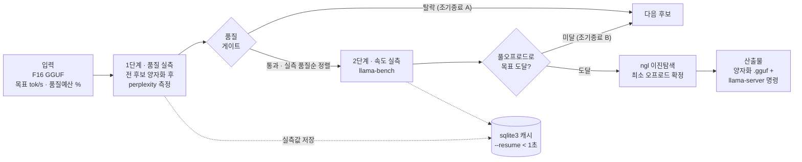

<div align="center">

**한국어** | [English](README.en.md)

# 🎯 FiTuna

**llama.cpp 설정, 추측하지 말고 측정하세요.**

모델과 목표 속도, 허용 품질손실을 입력하면 — 내 기기에서 실제로 그 수치를
달성하는 가장 가벼운 llama.cpp 설정(양자화 × GPU 오프로드 × 컨텍스트)을
실측 벤치마크로 찾아 돌려줍니다.

**`pip install fituna`**

[](https://github.com/leeyunseokarchive/fituna/actions/workflows/ci.yml)
[](https://pypi.org/project/fituna/)
[](LICENSE)
[](https://www.python.org/downloads/)
[](docs/SBOM.md)
[](CONTRIBUTING.md)

**심사위원 · 검증기관용 한국어 재현 가이드 → [REVIEWERS.md](REVIEWERS.md)**


</div>

## 왜 필요한가

로컬 LLM은 양자화 레벨(Q2–Q8), GPU 오프로드 레이어 수(`-ngl`), 컨텍스트
길이를 직접 골라야 하는데, 지금은 대부분 시행착오로 찾습니다.

| 기존 방법 | 한계 |
|---|---|
| Ollama · LM Studio | 모델별 고정 프리셋. 세밀한 양자화 제어 요청은 ["Closed as not planned"](https://github.com/ollama/ollama/issues/14674) |
| NVIDIA AutoQuantize | CUDA 전용 — Apple Silicon 불가 |
| VRAM 계산기 · 챗봇 조언 | 사양표 추정 — 내 기기의 발열·메모리 대역폭·빌드 플래그를 모름 |

실측은 자주 직관을 뒤집습니다. Apple M3 Pro 실측에서 "당연히 가장 좋을"
Q8_0이 속도 목표에서 탈락했고, 답은 양자화 하나가 아니라 **Q4_K_M에 최소
오프로드 `-ngl 33`을 더한 조합**이었습니다. 사양표로는 예측할 수 없습니다.

## 2분 체험

258 MB 모델로 전체 파이프라인(다운로드 → 양자화 → 품질 게이트 → 벤치마크)을
1분 남짓에 돌려볼 수 있습니다:

```bash
pip install fituna            # Python 3.11+ 가상환경에 (macOS 시스템 python3는 3.9)
brew install llama.cpp        # 엔진. 다른 플랫폼은 소스 빌드 (아래 '설치' 참고)
fituna fetch-corpus --lang en --out wiki.txt
fituna run --hf bartowski/SmolLM2-135M-Instruct-GGUF \
  --target-tps 240 --max-quality-loss 5 --ctx 2048 --wikitext wiki.txt --out ./out
```

같은 M3 Pro에서 실측: **콜드런 58초**에 `MEETS TARGET — Q8_0 @ ngl=24,
249.16 tok/s, 손실 0.29%`와 바로 쓸 `llama-server` 명령까지 출력.
`--resume` 재실행은 캐시에서 **0.8초**에 같은 답을 냈습니다.

## 실측 결과

| 모델 | 목표 | "당연한" 선택의 실측 | FiTuna가 찾은 답 |
|---|---|---|---|
| Qwen3-4B-Instruct | 30 tok/s, ≤5% 손실 | Q8_0: 24.22 tok/s ❌ (품질도 Q6_K보다 나쁘게 측정) | **Q4_K_M @ ngl=33 → 30.81 tok/s, 1.73%** ✅ |
| SmolLM2-135M | 240 tok/s, ≤5% 손실 | Q8_0: 205.91 tok/s ❌ | **Q6_K → 249.50 tok/s, 0.53%** ✅ (더 작은 Q4_K_M이 더 느린 역전 실측) |
| Midm-2.0-Mini (한국어) | 40 tok/s, ≤5% 손실 | Q8_0: 34.26 tok/s ❌ | **Q4_K_M @ ngl=48 → 44.62 tok/s, 2.58%** ✅ |

Apple M3 Pro, llama.cpp build 9960. 전체 로그·재실행 변동성 분석:
[docs/RESULTS.md](docs/RESULTS.md) · 사용 시나리오:
[docs/USE_CASES.md](docs/USE_CASES.md) · NVIDIA/Linux 재현(무료 T4):
[](https://colab.research.google.com/github/leeyunseokarchive/fituna/blob/main/notebooks/colab_nvidia_verification.ipynb)

## 동작 원리


```mermaid
flowchart LR
    A["입력<br/>F16 GGUF<br/>목표 tok/s · 품질예산 %"] --> B["1단계 · 품질 실측<br/>전 후보 양자화 후<br/>perplexity 측정"]
    B --> C{"품질<br/>게이트"}
    C -->|"탈락 (조기종료 A)"| X["다음 후보"]
    C -->|"통과 · 실측 품질순 정렬"| D["2단계 · 속도 실측<br/>llama-bench"]
    D --> E{"풀오프로드로<br/>목표 도달?"}
    E -->|"미달 (조기종료 B)"| X
    E -->|도달| F["ngl 이진탐색<br/>최소 오프로드 확정"]
    F --> G["산출물<br/>양자화 .gguf +<br/>llama-server 명령"]
    B -.실측값 저장.-> H[("sqlite3 캐시<br/>--resume < 1초")]
    D -.-> H
```

측정하지 않은 숫자로는 정렬할 수 없으므로 1단계가 **모든** 후보의 품질을
먼저 잽니다. 2단계는 실측 품질 순서대로 시험하고, 목표를 놓친 후보는 추가
벤치 없이 버립니다. 캐시 키에 llama.cpp 빌드 버전이 들어가므로 다른 빌드의
수치를 재사용하는 일이 없습니다. 상세:
[docs/ARCHITECTURE.md](docs/ARCHITECTURE.md)

## 설치

```bash
pip install fituna
```

Python 3.11+ 필요(macOS 시스템 `python3`는 3.9 — `python3.13 -m venv`로
가상환경을 먼저). 런타임 의존성은 없습니다. 엔진인 llama.cpp도 필요합니다:

```bash
brew install llama.cpp        # macOS/Linux Homebrew
```

<details>
<summary><b>소스 빌드 · 개발 설치</b></summary>

```bash
# llama.cpp 소스 빌드 (모든 플랫폼, NVIDIA는 -DGGML_CUDA=ON 추가)
git clone https://github.com/ggml-org/llama.cpp
cmake -S llama.cpp -B llama.cpp/build && cmake --build llama.cpp/build --config Release
# 이후 fituna 명령에 --llama-bin-dir llama.cpp/build/bin 추가

# FiTuna 개발 설치
git clone https://github.com/leeyunseokarchive/fituna
python3.13 -m venv .venv && source .venv/bin/activate
pip install -e fituna
```

</details>

## 명령어

| 명령 | 역할 |
|---|---|
| `fituna quickstart` | 6단계 대화형 마법사 — 환경 점검부터 탐색 실행까지. 조립한 `fituna run` 명령을 실행 전에 보여줌 |
| `fituna run` | 탐색 본체. `--model <F16.gguf>` 또는 `--hf repo[:file]`(HF에서 자동 다운로드), `--json` 지원 |
| `fituna doctor` | 환경 9개 항목 점검. 실패마다 해결 명령 제시 |
| `fituna fetch-corpus` | 품질 측정용 코퍼스 다운로드 (`--lang en/ko`, 표준 라이브러리만 사용) |
| `fituna detect-hw` | GPU·VRAM·CPU·RAM 자동 감지 결과 확인 |
| `fituna-mcp` | AI 에이전트용 MCP 서버 (아래 참고) |

<details>
<summary><b>품질 측정 코퍼스 고르기</b> — 같은 quant도 언어에 따라 2~3배 다른 손실</summary>

품질손실은 텍스트 코퍼스에 대한 perplexity 증가율이므로, 실제 사용할
텍스트와 비슷할 때만 의미가 있습니다. UTF-8 파일이면 무엇이든 됩니다
(`--quality-corpus`):

```bash
fituna fetch-corpus --lang en --out wikitext-2-raw-test.txt        # wikitext-2
fituna fetch-corpus --lang ko --out kowiki-corpus.txt --rows 500   # 한국어 위키백과
```

Run 3에서는 코퍼스만 바꿔도 도구의 판정이 바뀌었습니다
([실측과 단서 조항](docs/RESULTS.md#run-3--english-vs-korean-quality-corpus-same-model-same-quants)).
두 프리셋 모두 CC BY-SA 3.0이며 다운로드 완료 시 라이선스 고지를 출력합니다.

</details>

<details>
<summary><b>디스크 사용량 · 캐시</b></summary>

탐색은 품질 단계에 도달한 모든 후보를 양자화합니다 — 4B 모델의 후보 4개
기준 약 12 GB. 파일은 재실행 시 재사용되고 `--quant`로 후보를 좁혀 용량을
제한할 수 있습니다. 결과는 모델 지문 × 하드웨어 × llama.cpp 빌드 버전을
키로 sqlite3에 캐시되며, `--resume`은 1초 미만으로 재응답합니다.

</details>

<details>
<summary><b>라이브러리로 사용</b></summary>

런타임 의존성이 없어 모듈을 바로 임포트할 수 있습니다:

```python
from fituna.hardware import detect_hardware

hw = detect_hardware()
print(f"{hw.gpu_vendor.value}: {hw.gpu_name}, {hw.vram_mb} MB VRAM")
# apple: Apple M3 Pro, 18432 MB VRAM
```

탐색 자체는 `fituna.search.search()`를 호출하면 됩니다 — 필요한
`ModelInfo`·`BinaryPaths`·코퍼스 경로는 `fituna run`이 조립해 주는 것과
같습니다 ([search.py](fituna/search.py), [config.py](fituna/config.py)).

</details>

## MCP 서버 — AI 에이전트에게 실측 답변을

챗봇은 "내 컴퓨터에 맞는 설정"을 사양표에서 추측합니다. FiTuna MCP 서버를
연결하면 측정합니다:

```bash
claude mcp add fituna -- fituna-mcp      # stdio를 지원하는 모든 MCP 클라이언트
```

| 도구 | 반환 |
|---|---|
| `fituna_detect_hardware` | GPU 벤더·이름, VRAM, CPU 코어, RAM |
| `fituna_recommend` | 실측 탐색 결과 — 승자 설정, 실측 tok/s·품질손실, 실행 명령. 재요청 ~1초(캐시) |

외부 SDK 없이 표준 라이브러리로 구현한 JSON-RPC 2.0/stdio입니다
([mcp_server.py](fituna/mcp_server.py)).

## 범위와 한계

FiTuna는 **추천까지만** 합니다 — 산출물은 양자화된 `.gguf`와 복사해 쓰는
`llama-server`/`llama-cli` 명령(+`--export-ollama` 시 Ollama Modelfile)이고,
서빙은 llama.cpp의 일입니다([설계 근거](docs/ARCHITECTURE.md#why-this-shape)).

- **단일 GPU만 지원** — `--tensor-split` 없음 ([#11](https://github.com/leeyunseokarchive/fituna/issues/11), 멀티 GPU 기기 제공 환영)
- **Windows AMD 자동 감지 불가** — `--gpu amd --vram-mb <N>`으로 수동 지정
- **품질 = 선택한 코퍼스의 perplexity** — 대리 지표. 실제 작업과 비슷한 텍스트로 측정할 것
- **판정은 `--ppl-chunks`에 의존** — 예산에 가까운 후보는 재측정 후 신뢰 ([#8](https://github.com/leeyunseokarchive/fituna/issues/8), [측정된 영향](docs/RESULTS.md#how-big-is-a-perplexity-gap-the-error-bar-we-had-been-discarding))
- **벤치마크는 발열에 민감** — 목표와 몇 tok/s 차이의 판정은 경계선 ([변동성 분석](docs/RESULTS.md#run-to-run-variance-measured-not-hidden))
- **실기 E2E는 macOS·Linux** — Windows는 단위테스트·CI까지 ([#12](https://github.com/leeyunseokarchive/fituna/issues/12))

## 기여하기

코드베이스는 작고 의존성이 없으며 계약 우선으로 설계됐습니다 —
[fituna/config.py](fituna/config.py)에서 시작하세요. 유닛 테스트 256개와
3-OS × 2-Python CI가 지킵니다. 로드맵:
[v0.3.0 마일스톤](https://github.com/leeyunseokarchive/fituna/milestone/1) ·
[good first issue #10](https://github.com/leeyunseokarchive/fituna/issues/10) ·
[CONTRIBUTING.md](CONTRIBUTING.md) · [docs/DEVELOPMENT.md](docs/DEVELOPMENT.md)

## 라이선스

[MIT](LICENSE) © FiTuna contributors ·
[THIRD_PARTY_NOTICES.md](THIRD_PARTY_NOTICES.md) · [SBOM](docs/SBOM.md) ·
[오픈소스 활용](docs/OPEN_SOURCE_USAGE.md) ·
[AI 활용 개발 공개](docs/AI_MODEL_USAGE.md) · [CHANGELOG.md](CHANGELOG.md) ·
[SECURITY.md](SECURITY.md)
