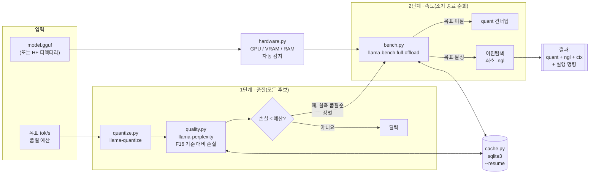

# FiTuna 아키텍처

## 개요

FiTuna는 llama.cpp 바이너리를 subprocess로 조율하는 Python 3.11 CLI입니다.
사용자가 정한 품질 손실 예산을 넘지 않으면서 처리량 목표를 만족하는 가장 가벼운
GGUF 양자화·실행 설정(`quant`, `-ngl`, `-c`)을 찾습니다. FiTuna 자체는 tensor
연산을 하지 않습니다. 추론, 양자화, perplexity 계산은 모두 llama.cpp C++
바이너리가 맡고 FiTuna는 실행 조율, 출력 해석, 탐색, cache를 담당합니다. Python
런타임 의존성은 0개이며 표준 라이브러리만 사용합니다.

## Pipeline 개요



**1단계**는 *모든* 후보의 perplexity 손실을 측정합니다. 2단계가 후보를
**실측** 품질 순서로 탐색하므로 측정하지 않은 값으로는 정렬할 수 없습니다. 실제로
검사한 두 모델 모두 관례적인 Q8_0 우선 순위가 틀렸습니다. **2단계**는 적극적으로
조기 종료합니다. Full offload bench에서 목표를 놓친 quant는 추가 측정 없이
버리고, 처음 통과한 quant를 선택합니다. 이보다 품질이 낮은 quant는 측정하지
않습니다.

모든 subprocess 결과는 모델 fingerprint, 하드웨어 profile, **llama.cpp 빌드
버전**을 key로 삼은 sqlite3 cache에 저장합니다. 따라서 `--resume`은 다른
backend 빌드에서 측정한 값을 반환하지 않습니다.

## 저장소 구조

```
fituna/
├── cli.py         # argparse entry point, 종료 코드 매핑(0/1/2/3)
├── quickstart.py  # run flag를 조립하는 대화형 마법사(fituna quickstart)
├── config.py      # 불변 dataclass interface 계약(단일 기준 정보원)
├── hardware.py    # GPU/VRAM/CPU/RAM 자동 감지 + 수동 재정의
├── binaries.py    # llama.cpp 바이너리 탐색 + 기능 확인
├── doctor.py      # 환경 자체 진단(fituna doctor 하위 명령)
├── corpus.py      # 품질 corpus 다운로드(fituna fetch-corpus, stdlib urllib)
├── errors.py      # config.py에 정의한 FiTunaError 계층의 재노출 shim
├── mcp_server.py  # MCP stdio server(JSON-RPC 2.0, fituna-mcp entry point)
├── model_info.py  # GGUF header 직접 해석(struct), HF 디렉터리 변환
├── quantize.py    # llama-quantize wrapper(멱등, atomic 쓰기)
├── quality.py     # llama-perplexity wrapper(품질 손실 측정)
├── bench.py       # llama-bench wrapper(처리량 측정)
├── search.py      # 2단계 탐색 orchestrator
├── cache.py       # sqlite3 결과 cache(--resume)
└── report.py      # 일반/JSON 결과 rendering + 실행 명령 생성
```

## 모듈 관계도

```
                              ┌───────────┐
                              │  cli.py   │  argparse entry point(run /
                              └─────┬─────┘  quickstart / detect-hw /
                                    │ list-binaries / doctor /
                                    │ fetch-corpus / help);
                                    │ TargetSpec 생성·작업 분배
        ┌───────────────┬──────────┼───────────┬──────────────────┐
        ▼                ▼          ▼           ▼                  ▼
  hardware.py      binaries.py  model_info.py  quantize.py    report.py
  GPU/CPU/RAM      llama.cpp    기반 GGUF 보장, llama-quantize  SearchResult
  감지 또는 수동    바이너리     ModelInfo 읽기  wrapper,       -> 실행 명령,
  입력 해석         탐색·확인    (n_layers 등)   디스크 재사용   JSON/일반 보고
        │                │          │                │              ▲
        │                │          │                │              │
        └────────┬───────┴────┬─────┴──────┬─────────┘              │
                  ▼            ▼            ▼                        │
           ┌─────────────────────────────────────┐                  │
           │              search.py               │  orchestrator   │
           │  품질 우선 filter (quality.py)        │──────────────────┘
           │  + ngl 이진탐색 (bench.py)            │
           │  + ctx grid 검사 (bench.py)           │
           └───────────┬───────────────┬──────────┘
                        ▼               ▼
                  bench.py         quality.py
                  llama-bench      llama-perplexity
                  wrapper          wrapper
                        │               │
                        └───────┬───────┘
                                ▼
                          cache.py (sqlite3)
                          BenchResult / QualityResult 재사용
                          key: (model_fp, hw_fp, candidate)

           fituna/config.py — 위 모든 모듈이 쓰는 불변 dataclass/Enum/예외
           (HardwareProfile, TargetSpec, BinaryPaths,
           ModelInfo, CandidateConfig, BenchResult, QualityResult,
           SearchResult, DoctorCheck, CorpusPreset, FiTunaError hierarchy).
           다른 모듈은 모듈 간 type을 따로 정의하지 않고 여기서 import한다.
```

화살표는 import가 아니라 호출 방향을 나타냅니다. `search.py`는 `quantize.py`,
`bench.py`, `quality.py`, `cache.py`를 호출하지만 이 모듈들은 `search.py`를
되부르지 않습니다. `cli.py`가 가장 많은 모듈을 import하고 호출합니다. 그 아래
모듈은 `config.py`와 필요한 경우 `binaries.py`의 `BinaryPaths`에만 의존합니다.
`cli.py` 위쪽의 entry point인 `quickstart.py`와 `mcp_server.py`도 여러 모듈에
접근하지만 탐색을 실행할 때는 `cli.py`를 거치므로 탐색 경로 구현은 하나뿐입니다.

`fituna/quickstart.py`는 `cli.py` 옆이 아니라 *위*에 있습니다. `fituna
quickstart` 마법사는 `input()`으로 답을 모아 `fituna run ...` argv를 조립하고
출력한 뒤, 같은 argv를 `cli._build_parser()`로 다시 해석해 process 안에서
`cli._cmd_run()`을 호출합니다. 1단계는 `doctor.run_checks()`, 메모리 적합 계산은
`hardware.detect_hardware()`, 5단계는 `corpus.fetch_corpus()`, 모든 파일 크기는
`report.human_size()`처럼 기존 모듈만 조율하며 논리를 복제하지 않습니다. 조립한
모든 *탐색 매개변수*는 공개 `run` flag에 대응합니다. 자체 점검(`python -m
fituna.quickstart --selfcheck`)이 완성한 argv를 assertion으로 검사하므로 마법사
전용 탐색 설정이 생기면 실패합니다. 이 검사는 run argv만 다루며, 엄선 모델
다운로드·HuggingFace 검색·corpus 받기처럼 `run`에 대응 기능이 없는 마법사 전용
편의 기능은 범위 밖입니다. 모델 다운로드는 `corpus.py`와 같은 임시 파일 +
`os.replace` atomic pattern을 표준 라이브러리 `urllib`로 구현했습니다.
HuggingFace `/api/models` 검색 endpoint의 응답 구조는 모듈 docstring에 기록했고
실제 API로 확인했습니다.

`fituna/mcp_server.py`는 `cli.py`와 나란히 둔 더 얇은 두 번째 entry point입니다.
SDK 의존성 없이 표준 라이브러리만 사용하는 MCP stdio server로, 줄 단위 JSON-RPC
2.0을 처리합니다. `fituna_detect_hardware`와 `fituna_recommend` 도구를 제공해
AI agent가 `cli.py run`과 같은 방식으로 실측 설정을 요청할 수 있습니다.
`cli.py`를 shell로 실행하지 않고 `binaries.py`, `hardware.py`, `model_info.py`,
`search.py`, `report.py`, `cache.py`를 직접 호출합니다. 항상
`cache.ResultCache`를 활성화하므로 같은 모델·하드웨어에 대한 반복 질문에는 약
1초 안에 답합니다.

## 실행 중 데이터 흐름(`fituna run` 1회)

1. `cli.py`가 argv를 CLI 인자로 해석하고 `TargetSpec`을 조립합니다.
   `--model`, `--target-tps`, `--max-quality-loss`, `--ctx`는 첫 값을
   `.ctx`로 삼는 `ctx_candidates`, `--quant`는 품질 내림차순으로 다시 정렬한
   `quant_candidates`가 됩니다.
2. `hardware.detect_hardware()`가 사용할 수 있는 `nvidia-smi`, `rocm-smi`,
   `system_profiler`, `platform`을 실행합니다. `--gpu`·`--vram-mb`를 주면
   `parse_manual_hardware()`가 자동 감지 결과와 합치며 사용자 값이 우선합니다.
   결과는 `HardwareProfile`입니다.
3. `binaries.locate_binaries(bin_dir=...)`가 `PATH` 또는
   `--llama-bin-dir`에서 `llama-quantize`, `llama-bench`,
   `llama-perplexity`를 찾고 선택 항목인 `llama-imatrix`,
   `convert_hf_to_gguf.py`도 확인합니다. 필수 도구가 없으면 설치 안내를 담은
   `BinaryNotFoundError`를 발생시킵니다. `list_supported_quant_types()`는
   `llama-quantize --help`를 해석해 `TargetSpec.quant_candidates`를 설치된
   빌드가 실제로 지원하는 형식만 남기도록 줄입니다.
4. `model_path`가 `.gguf`가 아니면 `model_info.ensure_base_gguf()`가
   `binaries.convert_script`로 HF 디렉터리를 `work_dir/base-f16.gguf`로
   변환합니다. 실패하면 `ModelConversionError`를 발생시킵니다. 이어서
   `read_model_info()`가 architecture, layer 수, parameter 수를 읽어
   `ModelInfo`를 만듭니다. `n_layers`는 `-ngl` 탐색의 상한입니다.
5. `search.search()`가 아래 알고리즘을 조율합니다.
   `binaries.BinaryPaths`를 통해 `quantize.quantize()`, `bench.run_bench()`,
   `quality.evaluate_quality()`를 호출합니다. `--resume`을 주면 모든
   bench·품질 호출을 `cache.ResultCache`에 저장합니다. 실제 해답
   (`meets_target=True`) 또는 최선 결과인 `SearchResult`를 반환하며, 근접한
   결과도 없으면 `NoFeasibleConfigError`를 발생시킵니다.
6. `report.py`는 `SearchResult`를 이미 생성된 GGUF의 세 가지 사용법으로
   바꿉니다. `build_server_command()`는 OpenAI 호환 로컬 API인
   `llama-server` 명령, `export_ollama_modelfile()`은 `--export-ollama`를
   줬을 때 `.gguf` 옆에 atomic 방식으로 쓰는 Ollama `Modelfile`,
   `build_run_command()`는 대화형 점검용 `llama-cli` 명령을 만듭니다.
   `to_human()`은 산출물 경로와 크기를 먼저 보여 주고 세 사용법을 이 순서로
   나열합니다. `to_json()`은 기존 field 옆에 `llama_server_command`와
   `modelfile_path`를 추가합니다. `cli.py`는 `--json`에 따라 둘 중 하나를
   stdout에 출력합니다. `llama-cli`와 `llama-server`는 *위치만 찾고 실행하지
   않습니다.*

## 탐색 알고리즘(`search.search()` 내부)

Bench 호출 수를 `O(quant × log(n_layers))`로 제한한 2단계 grid 탐색입니다.
Perplexity는 `ngl`이나 `ctx`가 아닌 `quant`에만 의존하므로 품질과 속도를 분리할
수 있습니다. 품질은 quant마다 한 번만 계산하며 속도를 찾는 동안 다시 측정하지
않습니다.

```
1단계 — 품질 사전 filter(quant마다 llama-perplexity 한 번 호출)
  baseline_ppl = compute_perplexity(base F16 GGUF)      [cache, 한 번만 계산]
  for quant in quant_candidates ∩ list_supported_quant_types():
      gguf = quantize(base_gguf, quant)
      q = evaluate_quality(quant, gguf, baseline_ppl, wikitext_path)
      q.quality_loss_pct <= max_quality_loss_pct이면 quant 유지
  quality_filtered = 통과한 quant를 원래 품질 내림차순(Q8_0 → Q2_K),
                      곧 최고 품질 우선으로 정렬

2단계 — quant별 속도 탐색(최고 품질 우선, 첫 통과가 승자)
  for quant in quality_filtered:
      gguf = quantize(base_gguf, quant)                  # 멱등, 1단계 결과 재사용
      top  = run_bench(gguf, ngl=n_layers, ctx=target.ctx)
      if top.gen_tok_per_sec < target_tps:
          continue                        # 조기 종료 B: 다음 저품질 quant로 이동
      if hw.gpu_vendor == NONE:
          return result(quant, ngl=0, top)                # CPU 전용, ngl 탐색 없음
      low = run_bench(gguf, ngl=0, ctx=target.ctx)
      if low.gen_tok_per_sec >= target_tps:
          return result(quant, ngl=0, low)                 # 조기 종료 C: GPU 불필요
      # target_tps를 만족하는 최소 ngl을 [0, n_layers]에서 이진탐색
      # gen_tok_per_sec가 ngl에 따라 감소하지 않는다고 가정하며, 최악에는
      # 이미 목표를 만족한다고 확인한 `top`으로 fallback
      lo, hi, best, calls = 0, n_layers, top, 0
      while lo < hi and calls < target.ngl_max_calls:
          mid = (lo + hi) // 2
          r = run_bench(gguf, ngl=mid, ctx=target.ctx); calls += 1
          if r.gen_tok_per_sec >= target_tps: best, hi = r, mid
          else:                                lo = mid + 1
      # 남은 ctx_candidates에서 best.ngl 재검증
      return result(quant, ngl=best.candidate.ngl, best)    # 여기 도달한 첫 quant 선택
  raise NoFeasibleConfigError(closest=fastest attempt seen)  # 모든 quant가 조기 종료 B 실패
```

조기 종료는 세 곳에서 일어납니다. **A** — 품질 gate를 통과하지 못한 quant는
속도 benchmark로 넘어가지 않습니다. **B** — full GPU offload에서도 목표를 놓친
quant는 바로 버리고 보통 더 빠른 다음 저품질 후보를 시도합니다. **C** —
`ngl=0`에서 목표를 달성하면 이진탐색을 생략하고 최소 자원 설정을 반환합니다.
Quant를 품질 내림차순으로 시도해 첫 성공에서 반환하므로 FiTuna는 가능한 설정 중
항상 *품질이 가장 좋은* 설정을 보고합니다. 나중에 측정했다는 이유로 저품질 후보를
고르는 일은 없습니다. 탐색 중 `max_bench_seconds`가 지나면 예외 대신 그때까지
찾은 최선 결과를 `meets_target=False`로 반환합니다.

`llama-bench` 호출 상한은 `N_quant_survived × (2 + ngl_max_calls +
len(ctx_candidates))`입니다. `fituna/config.py`의 `TargetSpec` 기본값에서는
최악의 경우 54회입니다(quant 6개, `ngl_max_calls=6`, ctx 후보 1개: 6 ×
(2 + 6 + 1)). 실제로는 조기 종료 덕분에 대개 10회 전에 끝납니다.

## 파일시스템 산출물

모든 side effect는 `--out`(`work_dir`) 아래 또는 llama.cpp 바이너리에서만
발생합니다. 나머지 함수는 `config.py` dataclass를 입력받아 값을 반환하는 순수
변환입니다.

```
<work_dir>/
├── base-f16.gguf            # model_info.ensure_base_gguf() — HF 디렉터리 입력일 때만
├── <model>-<fp12>-<quant>.gguf  # quantize.quantize() — 시도한 quant별 1개, 있으면 재사용
├── Modelfile                # report.export_ollama_modelfile() — --export-ollama에서만, atomic
└── .fituna_cache.sqlite3    # cache.ResultCache — bench_cache / quality_cache, --resume에서만
```

`quantize()`와 `ensure_base_gguf()`는 목표 경로에 파일이 이미 있으면 다시 만들지
않습니다. 같은 `--out`으로 `fituna run`을 다시 실행하면 `--resume`이 없어도
비용이 적습니다. `model_info.model_fingerprint()`는 전체 파일 hash가 아닌 저렴한
`sha256(name:size:mtime)`이며, "이 모델"을 식별하는 cache key 구성요소입니다.
하드웨어 fingerprint와 함께 사용하므로 다른 모델이나 컴퓨터의 cache 항목이
섞이지 않습니다. 같은 fingerprint의 앞 12자리 16진수는 양자화 `.gguf` 파일명
`<model>-<fp12>-<quant>.gguf`에도 들어갑니다. 이 값이 없으면 서로 다른 두 모델이
같은 관례적 기반 파일명으로 변환될 때 충돌합니다. 모든 HF 디렉터리 입력이
`base-f16.gguf`가 되므로 같은 `--out`에서 한 모델의 양자화 파일을 전혀 다른
모델의 "cache hit"로 조용히 내줄 수 있기 때문입니다.

## 오류 처리와 종료 코드

`cli.py`는 `config.py`에 한 번 정의하고 `errors.py`에서 다시 노출하는
`FiTunaError` 계층을 process 종료 코드로 매핑합니다.

| 종료 코드 | 조건 |
|---|---|
| 0 | 성공 — `search()`가 `meets_target=True`인 `SearchResult` 반환 |
| 1 | 일반 오류 — 그 밖의 `FiTunaError` 또는 목표를 만족한 설정이 없어 최선 결과를 반환한 `meets_target=False` |
| 2 | `BinaryNotFoundError` — 필수 llama.cpp 바이너리가 없으며 메시지에 설치 안내 포함. **동시에** argparse의 사용법 오류 코드이기도 함. `parser.parse_args()`가 직접 `sys.exit(2)`를 호출하므로 필수 flag 누락이나 알 수 없는 flag는 `main()`의 `FiTunaError` 매핑 전에 종료됨. stderr 첫 줄이 `usage: ...`이면 argparse, `... ERROR fituna: ...` log이면 `BinaryNotFoundError` |
| 3 | `NoFeasibleConfigError` — 모든 quant 후보가 품질 gate 또는 full offload 속도 검사에서 탈락. 진단용 최인접 시도는 `.closest`에 저장 |

HF→GGUF 변환 subprocess 실패인 `ModelConversionError`와
`llama-bench`·`llama-perplexity` timeout에서 발생한 `FiTunaError`는 모두 종료
코드 1입니다.

`fituna doctor`는 이 예외 매핑을 거치지 않습니다. `_cmd_doctor`가
`doctor.exit_code()`로 점검 결과에서 종료 코드를 직접 계산하므로 `main()`의
`FiTunaError` 처리를 완전히 우회합니다. 잡을 예외도 없습니다. 관련은 있지만 다른
조건에 같은 0·1·2를 재사용합니다. 모든 점검이 PASS 또는 WARN이면 0, 필수
llama.cpp 바이너리 세 개 중 하나라도 FAIL이면 위 `BinaryNotFoundError` → 2
관례에 맞춰 2, 그 밖의 FAIL은 1입니다. Doctor에는 종료 코드 3에 해당하는 값이
없습니다. `NoFeasibleConfigError`는 `run`에서만 생기며 doctor는 만들지 않습니다.

<a id="why-this-shape"></a>

## 이렇게 설계한 이유

- **Type의 단일 기준 정보원**(`fituna/config.py`) — 모듈 사이를 오가는 모든
  값은 한 번만 정의한 `frozen` dataclass 또는 `Enum`입니다. 모듈을 나눠 개발해도
  interface가 어긋나지 않습니다.
- **순수 함수와 명시적인 side effect** — 파일시스템을 건드리는 모듈은 `.gguf`를
  쓰는 `quantize.py`, 변환한 기반 `.gguf`를 쓰는 `model_info.py`, sqlite3에
  쓰는 `cache.py`, 받은 corpus를 쓰는 `corpus.py`, `--export-ollama`에서
  Ollama `Modelfile`을 쓰는 `report.py`, 받은 `.gguf`를 쓰는 `quickstart.py`
  뿐입니다. 나머지는 값을 반환합니다. 다운로드하는 세 경로는 모두 임시 파일 +
  `os.replace` pattern을 사용해 실행이 중단돼도 불완전한 파일을 남기지 않습니다.
- **Subprocess 격리** — llama.cpp 바이너리와의 모든 상호작용은 바이너리마다 하나의
  wrapper 함수(`quantize()`, `run_bench()`, `compute_perplexity()`)를 거칩니다.
  각 바이너리의 출력 해석 논리가 한곳에만 있습니다.
- **품질과 속도 분리** — perplexity는 `ngl`·`ctx`와 무관하므로 `search.py`는
  후보 설정마다가 아니라 quant마다 한 번 계산합니다. Benchmark 호출 수가
  `O(quant × ngl × ctx)`에서 `O(quant × log(n_layers))`로 줄어듭니다.
- **Cache는 의존성이 아니라 최적화** — `cache.py`를 호출하는 모든 모듈은
  `cache is None`, 곧 `--resume`을 주지 않았을 때도 subprocess를 직접 실행하며
  정상 동작합니다. Cache는 정확성에 필요하지 않고 실행 사이의 중복 호출만
  줄입니다.
- **추천하되 server를 운영하지 않음** — 의도한 범위 경계입니다. FiTuna는
  양자화 `.gguf`와 사용자가 복사해 실행할 `llama-server`·`llama-cli` 명령을
  출력합니다. `--export-ollama`를 주면 옆에 Ollama `Modelfile`도 씁니다.
  이들을 실행하거나 자체 inference server를 띄우지는 않습니다. 누락이 아니라
  경계입니다. 실제 inference 제공은 llama.cpp, Ollama, LM Studio의 역할이며 이를
  복제해도 차별점 없이 README에서 비교 대상으로 삼은 도구와 경쟁하게 됩니다.
  FiTuna가 내세우는 것은 *탐색*을 추측하지 않고 측정한다는 점뿐입니다. Server
  process도 런타임 의존성 0개 설계와 어울리지 않습니다. 추천 이후 Ollama 경로는
  이미 제공합니다. `--export-ollama`가 실측 `num_gpu`·`num_ctx`를 Modelfile에
  기록합니다. 그렇지 않으면 Ollama와 LM Studio 모두 모델별 고정 preset을
  적용하며, README가 인용한 [바로 그
  차이](https://github.com/ollama/ollama/issues/14674)입니다. 이 경계를 넘지
  않는 확장 후보로는 승리 명령 직접 실행(`--launch`)과 LM Studio preset
  export가 있지만 현재 릴리스에는 없습니다. Agent용 경로는 MCP server가 이미
  담당합니다. Agent가 `fituna_recommend` 응답을 읽고 후속 행동을 정하므로 사람이
  명령을 복사할 필요가 없습니다.
