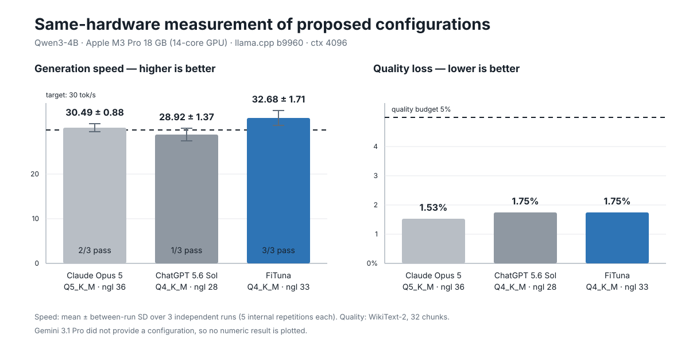

# 챗봇 제안 설정과 FiTuna 산출 설정의 동일 환경 실측 비교

이 문서는 대회 결과보고서의 비교 실험을 재현 가능한 수치로 기록한다. 목적은
챗봇의 일반 성능을 순위화하는 것이 아니라, 각 방식이 최종 제시한 설정이 동일
하드웨어에서 목표를 얼마나 안정적으로 만족하는지 확인하는 것이다.

## 실험 질문과 조건

각 방식에 Qwen3-4B를 Apple M3 Pro에서 실행할 때 다음 조건을 만족하는 설정을
요청했다.

- 목표 생성 속도: 30 tok/s 이상
- 허용 품질 손실: F16 대비 perplexity 증가율 5% 이하
- 컨텍스트 길이: 4096
- 비교 대상: FiTuna, Claude Opus 5, ChatGPT 5.6 Sol, Gemini 3.1 Pro

챗봇의 답변은 설정을 얻는 데만 사용했다. 속도와 품질 수치는 챗봇의 예측값이
아니라, 제시된 설정을 같은 환경에서 직접 실행해 얻은 값이다.

| 항목 | 값 |
|---|---|
| 측정일 | 2026-08-26 |
| 하드웨어 | Apple M3 Pro, 18 GB, 14-core GPU |
| 모델 | `Qwen3-4B-Instruct-2507-F16.gguf` |
| 모델 SHA-256 | `336228a2810f17724ecd6e9e2e40e8381eee81e886316fee311ade2899c31030` |
| 모델 출처 | `unsloth/Qwen3-4B-Instruct-2507-GGUF` |
| llama.cpp | tag `b9960`, commit `a935fbffe1a3d31509c325c116454ab5d56b2eb8` |
| 속도 측정 | `llama-bench -d 3456 -p 512 -n 128 -o json`, 독립 실행 3회 |
| 품질 측정 | WikiText-2, `--chunks 32`, F16 PPL `8.8688 ± 0.29293` |

각 독립 실행 안에서 llama-bench가 기록한 5회 내부 반복을 먼저 평균냈다. 표의
속도는 이 독립 실행 평균 3개의 평균 ± 표본 표준편차다.

## 결과

| 산출 방식 | 제시한 설정 | 독립 실행별 gen tok/s | 평균 ± 실행 간 SD | 30 tok/s 통과 | 품질 손실 |
|---|---|---|---:|---:|---:|
| **FiTuna** | **Q4_K_M, `ngl=33`** | 31.65, 31.73, 34.65 | **32.68 ± 1.71** | **3/3** | **1.75%** |
| Claude Opus 5 | Q5_K_M, `ngl=36` | 29.48, 30.97, 31.03 | 30.49 ± 0.88 | 2/3 | 1.53% |
| ChatGPT 5.6 Sol | Q4_K_M, `ngl=28` | 27.38, 30.01, 29.38 | 28.92 ± 1.37 | 1/3 | 1.75% |
| Gemini 3.1 Pro | 설정 미제시(질의 수행 미지원) | — | — | 판정 불가 | — |



품질 손실은 다음 식으로 계산했다.

```text
(quant PPL - F16 PPL) / F16 PPL × 100
```

- Q5_K_M PPL `9.0049 ± 0.29877` → 1.53%
- Q4_K_M PPL `9.0240 ± 0.29666` → 1.75%

`ngl`은 perplexity의 차원이 아니므로 같은 Q4_K_M을 사용한 ChatGPT와
FiTuna 설정의 품질 손실은 같다.

## 해석

측정 가능한 세 설정은 모두 5% 품질 예산을 지켰다. 차이는 속도 목표의 반복
달성 여부와 GPU 오프로드 규모였다.

- FiTuna의 `ngl=33`은 세 번 모두 목표를 통과했다.
- Claude의 `ngl=36`은 FiTuna보다 3개 층을 더 오프로드했지만 한 번 미달했다.
- ChatGPT의 `ngl=28`은 가장 작은 오프로드를 제시했지만 한 번만 통과했다.
- Gemini는 설정을 제시하지 않아 수치 비교에서 제외했다.

따라서 이 실험이 지지하는 결론은 제한적이다. 사양과 공개 벤치마크만으로
특정 기기의 최소 통과 설정을 안정적으로 고르기 어렵고, 목표선 근처에서는
반복 실측이 필요하다. 이 결과만으로 챗봇의 다른 능력이나 일반적인 우열을
판단할 수는 없다.

## 다른 문서의 Qwen3-4B 수치와의 관계

[`RESULTS.md`](RESULTS.md)의 Qwen3-4B `30.81 tok/s`는 초기 탐색에서 기록한
단일 결과다. 이 문서의 `32.68 ± 1.71 tok/s`는 같은 FiTuna 설정을 이후 3회
독립 실행한 평균이다. 실행 간 변동성이 있으므로 두 값은 모순이 아니며,
반복 결과가 목표선 판정에 더 적합하다.

## 한계

- 한 대의 Apple M3 Pro와 한 모델만 비교했다.
- 챗봇 답변은 모델 버전·세션·질문 표현에 따라 달라질 수 있다.
- Claude와 ChatGPT 설정은 목표선에 가까워 실행별 판정이 흔들렸다.
- ChatGPT가 참고한 공개 속도값은 18-core GPU의 M3 Pro와 oMLX 환경이어서,
  이 실험의 14-core GPU·llama.cpp 환경에 직접 적용할 수 없다.
- Gemini의 미지원 응답은 성능 미달이 아니라 측정할 설정이 없었다는 뜻이다.
